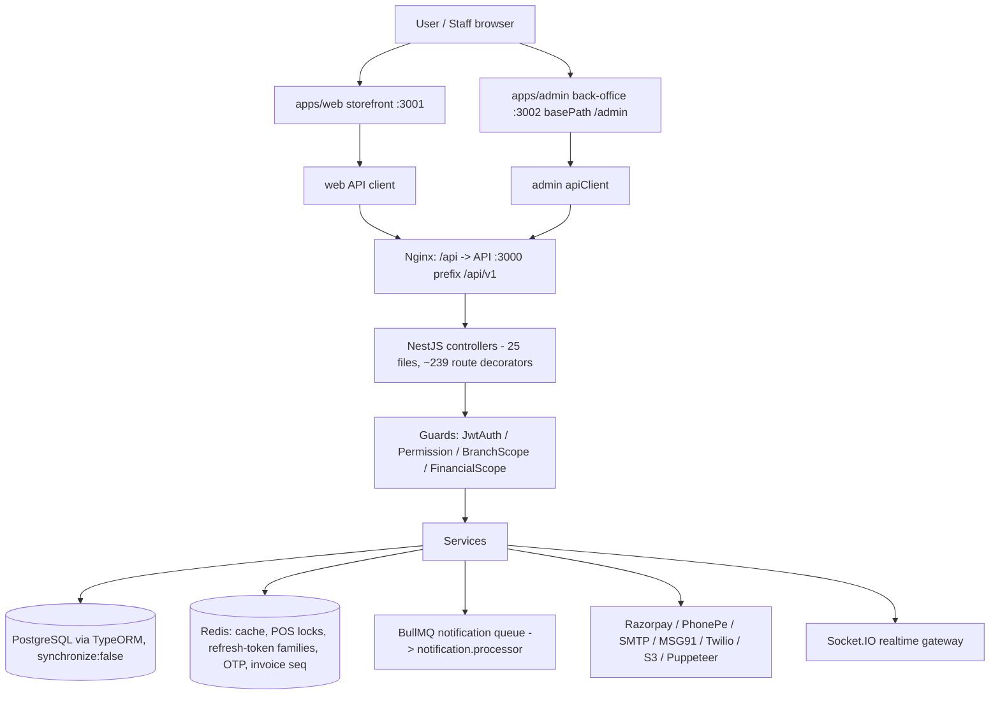
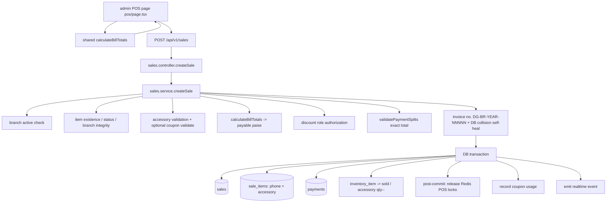
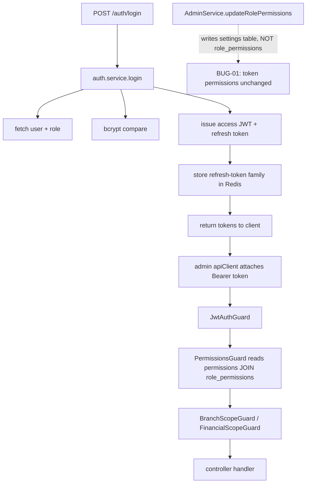
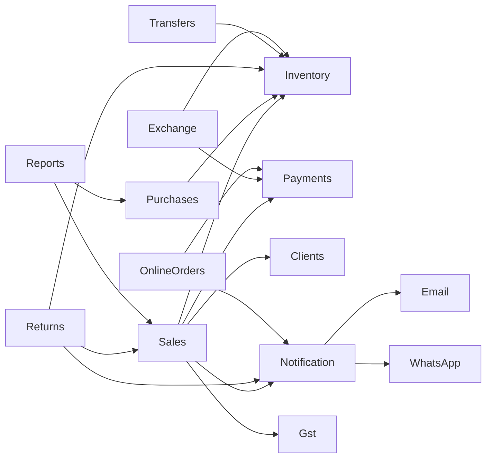

# DREAM GADGETS — CURRENT STATUS / FULL PROJECT FORENSIC DOCUMENTATION

> **Nature of this document.** This is a brutally exhaustive technical record of the repository as it exists on disk, produced by reading source files, migrations, configs and scripts, and by running a limited set of real commands. It is an **AUDIT**, not a README and not a marketing document.
>
> **What this document is NOT:** it is not a fix, not a refactor, and it is not a promise that anything works. Where evidence exists, the evidence is stated. Where it does not, the line says **UNKNOWN — NOT VERIFIED**. No application source code was modified to produce this document.
>
> **Audit date:** 2026-10-08
> **Repository root:** `/var/www/dream-gadgets` (the same path `deploy.sh` deploys to on the VPS)
> **Git HEAD at audit time:** `866c839 feat: multi-store isolation hardening and transactional Add Stock`
> **Branch:** `main` (tracking `origin/main`) — this document was committed as `9e23f9f`.

> **This document is a forensic snapshot of the project at the audit date.**
> It must be updated whenever a feature, API, database schema, configuration,
> flow, bug status, or production behavior changes. It is a **living project map**, not a one-time report.

---

## READ THIS FIRST

This single file is intended to let a developer or AI agent understand the whole application
without reading the source first. It is long on purpose.

- **Audit date:** 2026-10-08 · **Audited commit:** `866c839` (`main`) · **Doc commit:** `9e23f9f`.
- **Overall status:** a large, genuinely functional multi-branch retail platform; production-capable in its core POS/purchase/inventory/auth paths, but **not production-clean** — money-safety and CI gaps remain (§19, §25).
- **Read in this order:** §1 executive summary → §3 architecture → §7 business flows → §19 bug register → §25 EXECUTIVE TRUTH → §28 WHAT NOT TO TOUCH.
- **Status vocabulary** (used throughout; see §0 for the evidence legend):

| Emoji | Meaning |
|---|---|
| ✅ | VERIFIED WORKING |
| ⚠️ | PARTIALLY WORKING / PARTIAL |
| ❌ | CONFIRMED BROKEN |
| ⛔ | BLOCKED (environment / provider / data) |
| ❓ | UNVERIFIED / UNKNOWN — NOT VERIFIED |
| 🧹 | TECH DEBT |
| 🗑️ | DEAD / UNUSED / GARBAGE |
| 🔒 | DO NOT TOUCH WITHOUT CARE |

---

## 0. HOW TO READ THIS DOCUMENT (evidence legend)

Every finding is tagged with one of the following. This is the single most important convention in the file.

| Tag | Meaning |
|---|---|
| **VERIFIED WORKING** | Executed and observed to succeed during this audit (command output captured). |
| **VERIFIED BROKEN** | Executed and observed to fail, or statically proven impossible (e.g. code queries a DB column that no migration creates). |
| **PARTIALLY WORKING** | Some sub-cases work, others provably do not. |
| **IMPLEMENTED BUT UNTESTED** | Code exists and is wired, but no automated or manual verification was performed/available. |
| **UI EXISTS / BACKEND MISSING** | Frontend calls an endpoint that does not exist. |
| **BACKEND EXISTS / UI MISSING** | Endpoint exists but no in-repo caller. |
| **ROUTE EXISTS / UNUSED** | Same as above for controllers. |
| **DEAD CODE** | No reachable caller and no runtime path. |
| **DUPLICATE IMPLEMENTATION** | Two implementations of the same thing. |
| **LEGACY CODE** | Superseded implementation retained. |
| **CONFIGURED BUT UNUSED** | Config/env present but never read. |
| **REFERENCED BUT MISSING** | Imported/referenced file or column does not exist. |
| **BROKEN CONNECTION** | A call chain that cannot succeed as written. |
| **BLOCKED BY ENVIRONMENT** | Needs credentials/data/provider that are not present. |
| **UNKNOWN — NOT VERIFIED** | Could not be established from the available artifacts. |

**Security note:** No secret values are reproduced in this document. Only environment variable **names** are recorded. `.env` files exist on disk (see §16) and several `.env.bak-*` copies sit next to them on disk; `.env` is git-ignored but `.env.bak-*` matches no `.gitignore` rule (they are currently **untracked** but un-ignored) — itself a hygiene finding (§13, §16).

---

## 1. EXECUTIVE SUMMARY (60-second version)

Dream Gadgets is a **multi-branch second-hand / open-box mobile phone retail platform** for a real Kolkata-based business ("Dream Gadgets", 3 stores). It is an npm-workspaces monorepo with three runnable apps and two shared packages:

- `apps/api` — **NestJS 10 + TypeORM 0.3 + PostgreSQL + Redis + BullMQ** REST + WebSocket API (port 3000, global prefix `/api/v1`).
- `apps/admin` — **Next.js 14** back-office (port 3002, `basePath: '/admin'`): POS, inventory, purchases, sales, clients, transfers, returns/exchange, GST, reports, WhatsApp, EMI, coupons, buyback, banners, users/roles.
- `apps/web` — **Next.js 14** customer storefront (port 3001): catalog, cart, checkout, Razorpay/PhonePe, orders, buyback "sell your phone", account/address book, OTP login.
- `packages/shared-types` — enums, `JwtPayload`, `ApiResponse`, and a **byte-mirrored billing engine** (`calculateBillTotals`) shared by API and POS.
- `packages/ui` — shared React primitives (Button etc.).

**Overall state:** A large, genuinely functional system with unusually strong access-control and billing-integrity work, held back by (a) a set of **DB-column mismatches in the reporting layer** that make several reports return empty, (b) **CI that does not actually run the API unit tests**, (c) **dev-mode delivery fallbacks** that silently "succeed" outside production, and (d) **committed `.env.bak-*` files and two huge logo PNGs** bloating the repo.

**Verified during this audit:**
- `cd apps/api && npx jest` → **27 suites / 697 tests, all passing** (§18).
- The admin POS and API share one billing algorithm and a mirror-sync test enforces it (§12, §14).
- The invoice/PDF/void/email-invoice code paths exist and are internally consistent (§26).

**Verified broken / high-risk:**
- Root `jest.config.js` defines projects only for `tests/components/**` and `tests/integration/**` — directories that **do not exist**. CI's "Run API unit tests" runs `npx jest --testPathPattern="apps/api"` against that config and therefore matches **zero tests** (proved with `npx jest --listTests --testPathPattern="apps/api"` → empty) (§18, §19).
- `report.service.ts` queries columns that do not exist (`sales.is_inter_state`, `sales.created_by_id`, and `exchange_devices.brand/model/offered_price/final_price/branch_id`). Those queries throw, are swallowed, and the report returns `[]` (§14, §15, §19).
- `apps/web/app/partner/page.tsx` POSTs to `/public/partner/inquiry`, which has **no backend route** (§15).
- `client.service.ts#getHistory` reads `returns.return_amount` / `returns.status`, but the table has `refund_amount` / `refund_status` (§15, §19).

---

## 2. REPOSITORY STRUCTURE (what exists, and what is excluded)

### 2.1 Top level

```
dream-gadgets/
├── apps/
│   ├── api/        NestJS backend (src/, migrations, seeds, scripts, Dockerfiles)
│   ├── admin/      Next.js admin (basePath /admin)
│   ├── web/        Next.js storefront
│   └── uploads/    runtime image storage (banners/, buyback/, inventory/)
├── packages/
│   ├── shared-types/   enums, ApiResponse, JwtPayload, billing mirror
│   └── ui/             shared React UI primitives
├── tests/          api/ (contract spec) + e2e/ (Playwright)
├── docs/           ACCESS_CONTROL_RBAC.md, AUTHORIZATION_ENDPOINT_MATRIX.md, PURCHASE_GST_SPLIT_SCHEMA.md
├── scripts/        ops helpers
├── k8s/            api-deployment.yaml (single file)
├── .github/workflows/ci.yml
├── docker-compose.yml, ecosystem.config.js (PM2)
├── deploy.sh       (26 KB unified VPS deployment script)
├── test.sh, run-all-tests.sh, setup-tests.sh, tests/api/extended-tests.sh
├── jest.config.js, playwright.config.ts, turbo.json, tsconfig*.json
├── System.md, implementation.md, price-suggestion-logic.md, QA_REPORT.md, TEST_PLAN.md,
│   TEST_SUITE_SUMMARY.md, PUBLIC_ORDER_API_IMPLEMENTATION.md, SETUP.md, QUICK_START.md
└── (large binary/media) Logo_Dream_Gadgets.png, black-logo-for-light-bg.png (18 MB),
    white-logo-for-dark-bg.png (25 MB), shop-sales-dashboard.png, brand/, logos/, temp compare/
```

### 2.2 Explicitly excluded from line-by-line review

The following were **not** reviewed line-by-line and are intentionally not documented as if they were:

- `node_modules/` (958 package dirs), `.git/`, `.next/`, `dist/`, `.turbo/` — generated/vendor/content-addressable caches.
- `package-lock.json` (1.29 MB) — dependency lock; read only for the fact that it exists.
- `apps/api/dist/` — compiled output of `nest build`.
- `packages/shared-types/src/index.js|.d.ts|.js.map|.d.ts.map` — **generated** JavaScript + declarations committed next to their `.ts` sources. Note: `git log b7cd40d` says `dist` billing output was intentionally tracked so CI typecheck resolves the package. The committed `packages/shared-types/src/*.js` files are generated artifacts.
- `test-results/`, `coverage/` — test output dirs.

**Claim discipline:** for generated/vendor content this document makes **no** claim of manual review.

### 2.3 Monorepo toolchain (verified)

- Root `package.json`: `workspaces: ["apps/*","packages/*"]`, `packageManager: "npm@11.8.0"`, `engines.node >=20`.
- `turbo.json` pipeline: `build`, `dev` (persistent, no cache), `test`, `lint`.
- `tsconfig.base.json` → commonjs/lib ES2022/strict; root `tsconfig.json` targets ES2020 + jsx for the whole repo.
- `.npmrc`, `.prettierrc` present. No top-level ESLint config for the repo (per-app only).

---

## 3. RUNTIME ARCHITECTURE MAP

```
                              ┌────────────────────────────────────────────┐
                              │                 USERS                       │
                              │  customer (web)   staff (admin)   guest     │
                              └───────────────┬─────────────┬──────────────┘
                                              │             │
                    ┌─────────────────────────▼──┐   ┌──────▼─────────────────────┐
                    │  apps/web (Next 14 :3001)  │   │ apps/admin (Next 14 :3002) │
                    │  basePath none             │   │ basePath /admin            │
                    └───────────────┬────────────┘   └──────┬─────────────────────┘
                                    │ axios apiClient               │ axios apiClient
                                    │ (Bearer in localStorage,      │ (Bearer in localStorage,
                                    │  401→refresh queue)           │  presence cookie for
                                    │                               │  /admin middleware)
                                    └──────────────┬────────────────┘
                                                   │  HTTPS /api/v1/*
                               Nginx (deploy.sh writes config on VPS)
                                   / → 3001, /admin → 3002, /api → 3000, /socket.io → 3000
                                                   │
                    ┌──────────────────────────────▼──────────────────────────────┐
                    │  apps/api (NestJS :3000, prefix /api/v1)                     │
                    │  helmet → compression → CORS → body parsers → request log    │
                    │  → ValidationPipe(whitelist) → TransformInterceptor          │
                    │  → AllExceptionsFilter                                       │
                    │                                                              │
                    │  Guards: AuthGuard('jwt') → PermissionGuard → BranchScopeGuard│
                    │          → FinancialScopeGuard                               │
                    │  Interceptors: BranchFilterInterceptor (list scoping)        │
                    │  Middleware: AuditLogMiddleware (partial)                    │
                    └───────┬───────────────────────────┬──────────────────────────┘
                            │ TypeORM Repositories      │ BullMQ
                            ▼                           ▼
                  ┌──────────────────┐        ┌───────────────────────┐
                  │ PostgreSQL (pg)  │        │ Redis (redis v4)       │
                  │ 48 migrations    │        │ cache, tokens, OTP,    │
                  │ entities mapped  │        │ locks, invoice seq,    │
                  │                  │        │ idempotency, queues    │
                  └──────────────────┘        └──────────┬────────────┘
                                                         │
                                              ┌──────────▼───────────────┐
                                              │ Worker: NotificationProc  │
                                              │ queue "notification"      │
                                              └──────────┬───────────────┘
                                                         │ channels
                         ┌───────────────┬───────────────┼───────────────┬───────────────┐
                         ▼               ▼               ▼               ▼               ▼
                     Nodemailer       Twilio SMS     Twilio WhatsApp   MSG91 SMS/WA    Puppeteer
                     (SMTP)                                             (OTP)           (PDF)
                         + Razorpay + PhonePe (payments)   + Sentry (errors)  + Socket.io (realtime)
```

### 3.1 API bootstrap — `apps/api/src/main.ts`

- `initSentry()` runs **before** `NestFactory.create` (line ~2).
- Trust proxy enabled for Nginx (`set('trust proxy', 1)`).
- Static uploads served at `/api/v1/uploads` from `apps/uploads` (resolved as `join(__dirname,'..','..','uploads')` — from `dist/main.js` this is `apps/uploads`). ✓ consistent with `apps/uploads/` on disk.
- Helmet (CSP disabled), compression, CORS allow-list = `WEB_URL`, the `www.` variant of `WEB_URL`, `ADMIN_URL`; credentials true.
- Custom URL-encoded body parser mounted only on `/api/v1/public/whatsapp/webhook` (Twilio posts form-encoded).
- Request logger: JSON in production, human line in dev.
- `setGlobalPrefix('api/v1')`.
- Global `AllExceptionsFilter`, `ValidationPipe({whitelist:true, forbidNonWhitelisted:false, transform:true})`, global `TransformInterceptor`.
- Swagger at `/api/docs`.
- Port `process.env.PORT || 3000`.

**Finding — response envelope coupling (HIGH, historical).** `TransformInterceptor` (`apps/api/src/common/interceptors/transform.interceptor.ts`) auto-wraps every non-`{status,data}` return into `{status:'success',data:…}`, and list shapes `{data,total,page,limit}` into `{status,data,meta}`. Several controllers also hand-return `{status:'success',data:…}`, which is idempotent thanks to the `'status' in data && 'data' in data` early-return. Git history (`ea938b5`, `903ae72`) shows two production bugs caused by double-wrapping (address list, ITC). This is a **fragile pattern**: any endpoint whose payload happens to contain both `status` and `data` keys will be passed through unwrapped; callers must defensively unwrap (`data.data ?? data`), which is visible throughout both frontends.

### 3.2 API module wiring — `apps/api/src/app.module.ts`

Global imports: `ConfigModule.forRoot({isGlobal, load:[appConfig,databaseConfig,redisConfig], envFilePath:['.env.local','.env']})`, `TypeOrmModule.forRootAsync` (postgres, `synchronize:false`, entities glob, migrations glob, logging in development), `ThrottlerModule` (60 s / 100 default), `BullModule.forRootAsync` (redis), `CacheModule` (redis store, ttl 60), `RedisModule`, `EventsModule`.

Feature modules: Auth, Inventory, Purchase, Sales, Client, Transfer, Exchange, Return, Payment, Notification, Report, Admin, Realtime, Search, Public, Accessory, Buyback, Reviews, Gst, Health, Coupon, Whatsapp, Emi.

**Observation — `ThrottlerModule` is configured but no `ThrottlerGuard` is registered as a global/APP guard.** Per-route `@Throttle(...)` decorators exist (auth endpoints etc.), but without `APP_GUARD`/`@UseGuards(ThrottlerGuard)` the throttler is **effectively inert** (`CONFIGURED BUT UNUSED`). See §16/§19.

---

## 4. AUTHENTICATION & AUTHORIZATION (full map)

### 4.1 Login / token model

`apps/api/src/modules/auth/auth.controller.ts` (`@Controller('auth')`):

| Method | Path | Throttle | Auth | Notes |
|---|---|---|---|---|
| POST | `/auth/login` | 10/min | public | identifier (email or phone) + password |
| POST | `/auth/refresh` | — | public | rotates refresh token |
| POST | `/auth/logout` | — | public | invalidates refresh family |
| POST | `/auth/register` | 5/min | public | phone+OTP (or widget token) |
| POST | `/auth/send-otp` | 3/min | public | returns `{devOtp}` only in dev-mode |
| POST | `/auth/login-otp` | 3/min | public | passwordless send |
| POST | `/auth/login-otp/verify` | 5/min | public | passwordless verify → tokens |
| POST | `/auth/widget-verify` | 10/min | public | exchanges MSG91 widget access token for session |
| POST | `/auth/forgot-password` | 3/min | public | 204; sends email AND SMS if available |
| POST | `/auth/reset-password` | 5/min | public | 204 |
| GET | `/auth/me` | — | **JWT** | profile incl. role+branch |
| PATCH | `/auth/me` | — | **JWT** | name/email/notification prefs |
| POST | `/auth/change-password` | — | **JWT** | requires current password |
| GET | `/auth/verify-email` | 10/min | public | `?token=` |
| POST | `/auth/resend-verification` | 3/min | public | 60 s cooldown |

`apps/api/src/modules/auth/auth.service.ts` (738 lines) implements:
- **Password login** with **account lockout**: 5 failed attempts → 15-min lock (`LOCKOUT_THRESHOLD`, `LOCKOUT_TTL_SECONDS`), tracked in Redis (`redis.service.ts` `login:attempts:*`, `login:lockout:*`).
- **Refresh-token rotation with family revocation**: access token carries `{sub,email,role,permissions,branchId,financialScope}`; refresh token carries `{sub,family}` and is stored in Redis under `refresh:{userId}:{family}`. Reusing a rotated/unknown token invalidates **all** of a user's families (`invalidateAllFamilies`). This is a solid, above-average implementation. **VERIFIED WORKING** at the unit level (auth.service.spec.ts passes).
- **Permissions** are loaded from `permissions` ⨝ `role_permissions` and cached in Redis under `perms:role:{roleId}` (TTL 300 s); `invalidatePermissionCache()` is called on role edits and on `POST /admin/roles/:id/invalidate-permissions`.
- **Financial scope**: `'all'` for `shop_owner`; `'branch'` when the user holds `financial.view` **and** `users.financial_access`; else `'none'`.
- **Registration**: normalizes phone to E.164 digits (`91XXXXXXXXXX`) via `common/utils/phone.ts`; duplicate check runs before OTP consumption; customer role looked up by name `'customer'` from the DB.
- **OTP**: `msg91-otp.service.ts` — crypto-random 6-digit code, stored in Redis (`otp:{phone}`, TTL from `MSG91_OTP_TTL` default 600 s), 5-attempt brute-force limit, timing-safe comparison, 10 s resend cooldown (`otp:resend:{phone}`), **WhatsApp-first then SMS fallback** when `MSG91_WHATSAPP_ENABLED=true`. In non-production with MSG91 unset, it logs the OTP and returns it as `devOtp`; **in production it fails loudly** ("SMS service is not configured"). ✓ Good security posture.
- **MSG91 Widget**: `msg91-widget.service.ts` verifies a widget access token server-side; phone is taken from the provider, not the client.

### 4.2 Guards

| Guard | File | Behavior |
|---|---|---|
| `PermissionGuard` | `common/guards/permission.guard.ts` | Reads `@RequirePermission('module.action')`; requires `user.permissions.includes(perm)`; throws `FORBIDDEN`. |
| `BranchScopeGuard` | `common/guards/branch-scope.guard.ts` | For `@BranchScoped()` endpoints: GET injects `branchId=user.branchId`; mutations reject a body/param `branchId` that differs. `CROSS_BRANCH_ROLES = {shop_owner, multi_store_manager}`. |
| `FinancialScopeGuard` | `common/guards/financial-scope.guard.ts` | For `@RequireFinancialAccess()`: `none` → denied; `branch` → forces query `branchId`. |
| `BranchFilterInterceptor` | `common/interceptors/branch-filter.interceptor.ts` | Injects `branchId` into list queries for non-cross-branch roles. |

**Authorization model in one sentence:** JWT carries a denormalized permission list + `branchId` + `financialScope`; `PermissionGuard` gates by list membership; `BranchScopeGuard`/`BranchFilterInterceptor` enforce store scoping; individual services additionally re-check branch ownership on single-resource access (e.g. `SalesService.assertBranchAccess`, `InventoryService.assertBranchAccess`).

**Findings**
- **Store-manager asymmetry (documented, intentional per comments):** the branch-scope comment block calls store managers "global" but `CROSS_BRANCH_ROLES` deliberately excludes `store_manager` — so store managers are **assigned-store only**. The comment text ("Owners, multi-store managers, and store managers have global access") is **stale/inaccurate** relative to the code. (`LOW` — documentation drift.)
- **`FinancialScopeGuard` does not enforce a permission** — it only checks `financialScope`. A user with `financialScope !== 'none'` but without e.g. `financial.view` on a given endpoint would pass the *guard*; the route's `@RequirePermission` is the real gate. In practice only the composite `financial.view` + `financial_access` produces `'branch'`, so this is acceptable but fragile.
- `AuditLogMiddleware` is **defined but never registered** in `AppModule` (no `configure(consumer)` exists). Audit writes that *do* happen come from explicit `dataSource.query('INSERT INTO audit_logs…')` calls inside services. So the middleware is `DEAD CODE`. (§13)
- The realtime gateway `RealtimeGateway.handleConnection` joins `'admin'` room when `!payload.branchId || payload.role === 'Shop Owner'` — the role string check uses `'Shop Owner'` (display style) while tokens carry role `name` = `shop_owner`. **Inconsistent role-string matching** (`HIGH` for correctness of admin-room membership). A `shop_owner` who has a `branchId` would **not** join `'admin'`. See §17/§19.

### 4.3 JWT strategy

`jwt.strategy.ts` — standard `passport-jwt` bearer extraction, `ignoreExpiration:false`, secret `app.jwtSecret`. `local.strategy.ts` — usernameField `identifier`, delegates to `AuthService.validateUser` (**not used by any controller**; login calls `authService.login` directly → `LocalStrategy` is `DEAD CODE`).

### 4.4 Frontend auth

- **admin** (`apps/admin/lib/api.ts`, `store/auth.store.ts`, `middleware.ts`, `lib/session.ts`): tokens in `localStorage` (`admin_access_token`, `admin_refresh_token`); zustand persist key `admin-auth-storage`; a **presence cookie** `admin_session=1` (7 days) is the only cookie and is what Next middleware checks — because the JWT is too big for a cookie (documented in `session.ts`). 401 → single-flight refresh queue; 403 is **not** refreshed. Good.
- **web** (`apps/web/lib/api.ts`, `store/auth.store.ts`): `access_token`/`refresh_token` localStorage, zustand `auth-storage`, same 401 refresh pattern, plus a documented fix to prevent a redirect loop by **not** re-syncing expired tokens.
- Admin `middleware.ts` `PUBLIC_PATHS=['/login']`, matcher excludes `_next/static`, `_next/image`, `favicon.ico`. Because `basePath='/admin'`, `pathname` is stripped of the base path — the code comments assert this correctly.

---

## 5. DATABASE (schema, migrations, entities)

> **IMPORTANT CORRECTION TO THE TASK BRIEFING:** the project does **not** use Prisma. It uses **TypeORM 0.3** with an explicit migrations directory and `synchronize:false`. There is no `schema.prisma`.

- Data source: `apps/api/src/database/data-source.ts` (loads `.env.local` then `.env`, entities `src/**/*.entity{.ts,.js}`, migrations `src/database/migrations/*`).
- Migrations: **48 files** (`001`…`048`), plus some duplicated numeric prefixes (`004-add-sale-void-columns.ts` and `004-create-transfer-exchange-tables.ts`; `006` appears twice). TypeORM orders by class name, which is why several migration class names carry timestamps (see git `97337eb` "give migration 042 the timestamped name TypeORM requires").
- Seeds: `001-seed-roles-permissions`, `002-seed-settings-branch`, `003-seed-test-users`, `005-seed-exchange-price-guide`, orchestrated by `run-seeds.ts`. There is **no `004` seed file** (gap is harmless).

### 5.1 Tables created by migrations (authoritative list)

From `CREATE TABLE` statements: `roles`, `permissions`, `role_permissions`, `branches`, `users`, `brands`, `models`, `purchases`, `inventory_items`, `item_photos`, `clients`, `sales`, `sale_items`, `online_orders`, `payments`, `invoice_sequences`, `stock_transfers`, `stock_transfer_items`, `exchange_devices`, `exchange_price_guide`, `online_order_items`, `returns`, `return_items`, `notifications`, `audit_logs`, `settings`, `content_banners`, `content_pages`, `kyc_documents`, `product_reviews`, `buyback_leads`, `buyback_photos`, `contact_inquiries`, `coupons`, `emi_providers`, `emi_plans`, `price_guide_audits`, `whatsapp_conversations`, `whatsapp_messages`, `whatsapp_templates`, `whatsapp_campaigns`, `whatsapp_campaign_logs`, `whatsapp_appointments`, `whatsapp_automation_rules`, `whatsapp_notifications`, `whatsapp_tags`, `whatsapp_customer_preferences`, `whatsapp_click_events`, `customer_addresses`.

### 5.2 Entity-mapped models (TypeORM `@Entity`)

`Role`(roles), `Branch`(branches), `User`(users), `Brand`(brands), `Model`(models), `InventoryItem`(inventory_items), `ItemPhoto`(item_photos), `Accessory`(accessories), `Client`(clients), `Sale`(sales), `SaleItem`(sale_items), `Payment`(payments), `OnlineOrder`(online_orders), `OnlineOrderItem`(online_order_items), `Purchase`(purchases), `PurchaseItem`(purchase_items), `Return`(returns), `ExchangeDevice`(exchange_devices), `StockTransfer`(stock_transfers), `StockTransferItem`(stock_transfer_items), `Notification`(notifications), `Setting`(settings), `Banner`(content_banners), `ContentPage`(content_pages), `Review`(product_reviews), `BuybackLead`(buyback_leads), `BuybackPhoto`(buyback_photos), `Coupon`(coupons), `EmiProvider`(emi_providers), `EmiPlan`(emi_plans), `WhatsappConversation`, `WhatsappMessage`, `WhatsappTemplate`, `WhatsappCampaign`, `WhatsappAppointment`.

### 5.3 Tables with **no entity** (accessed via raw SQL only)

`permissions`, `role_permissions`, `return_items`, `invoice_sequences`, `kyc_documents`, `audit_logs`, `exchange_price_guide`, `price_guide_audits`, `whatsapp_campaign_logs`, `whatsapp_automation_rules`, `whatsapp_notifications`, `whatsapp_tags`, `whatsapp_customer_preferences`, `whatsapp_click_events`, `customer_addresses`, `contact_inquiries`.

Some of these are purposeful (join/permission tables, audit, raw-SQL reports). Others — `whatsapp_campaign_logs`, `whatsapp_automation_rules`, `whatsapp_notifications`, `whatsapp_tags`, `whatsapp_customer_preferences` — appear **unused by current code** and are candidates for "orphan table" status (§9, §13).

### 5.4 Key relationships

```
Sale ──1:N── SaleItem        (sale_items.sale_id, ON DELETE CASCADE)
Sale ──1:N── Payment         (payments.sale_id)
Sale ──N:1── Client          (sales.client_id)   [relation added later via joins]
Sale ──N:1── Branch          (sales.branch_id, NOT NULL)
Sale ──N:1── User            (sales.created_by)
Sale ──1:N── Return?         indirect via returns.original_id (no FK)
Purchase ──1:N── PurchaseItem (purchase_items.purchase_id, CASCADE)
Purchase ──1:N── InventoryItem (inventory_items.purchase_id)
InventoryItem ──N:1── Brand/Model/Branch/User
InventoryItem ──1:N── ItemPhoto (CASCADE)
OnlineOrder ──1:N── OnlineOrderItem (CASCADE) ──1:N── Payment
Client ──1:N── Sale / OnlineOrder / ExchangeDevice
Branch ──1:N── users, inventory_items, sales, purchases, transfers, orders
Role ──1:N── users
Coupon (created_by User) ; EmiProvider ──1:N── EmiPlan (CASCADE)
BuybackLead ──1:N── BuybackPhoto (CASCADE)
StockTransfer ──1:N── StockTransferItem (CASCADE) ──N:1── InventoryItem
WhatsappConversation ──1:N── WhatsappMessage (CASCADE)
```

### 5.5 Orphan-risk / suspicious schema points (evidence-based)

1. **`Sale` has `client_id` but no DB-level FK to `clients` in the original migration 003?** Correction: migration 003 **does** declare `clients` first and `sales.client_id UUID REFERENCES clients(id)`. ✓ Fine. (The code comment on the `Sale.client` relation about "previously every sale rendered as Walk-in" refers to a missing ORM relation, not a missing FK.)
2. **`payments.exchange_device_id`** exists in the table (migration 003) with an FK added by 004, but the `Payment` entity does **not** map it → the column is written by nothing and read by nothing (`schema field never used`).
3. **`invoice_sequences`** table exists but `SalesService` uses **Redis** for invoice sequencing (`redisService.getNextInvoiceSequence`). The DB table appears unused (legacy).
4. **`kyc_documents`** exists but `Client` explicitly comments that eKYC documents are stored on `clients.tags` jsonb; `ekycDocuments` is a **virtual field** never persisted. So the table is unused and eKYC document persistence is a **no-op**.
5. **`products.permissions`** — the seed includes a `products` module with action `publish`, but no endpoint declares `@RequirePermission('products.*')`. `inventory.toggle-online` is gated by `inventory.edit`. So `products.publish` is a **permission that exists but gates nothing**.
6. **`client.entity.ts` maps `ekyc_verified_by`, `created_by` etc. with comment corrections** — the entity author had to patch column names (`ekyc_verified_by` not `..._id`). These corrections are evidence of an earlier schema drift.

### 5.6 `clients` columns vs. legacy query drift

The `returns` table columns are `refund_amount`, `refund_status`, `reason`, `created_at`, `client_id`. `ClientService.getHistory` (`apps/api/src/modules/client/client.service.ts`, `getHistory`) selects `r.return_amount, r.reason, r.status` — **none** of `return_amount`/`status` exist. Because each query is wrapped in a `safeQuery` that swallows errors and returns `[]`, the client history silently shows empty returns. **BROKEN CONNECTION** (§15, §19).

---

## 6. API ENDPOINT CATALOG

Global prefix `/api/v1` applies to all paths below. "Auth" = `AuthGuard('jwt')`; "Perm" = required `@RequirePermission`.

### 6.1 AuthModule (`auth`)

Covered in §4.1. Not repeated.

### 6.2 AdminModule (`admin`) — `apps/api/src/modules/admin/admin.controller.ts`

Controller-level `@UseGuards(AuthGuard('jwt'), PermissionGuard)`.

| Method | Path | Perm |
|---|---|---|
| GET | `/admin/users` | users.view |
| POST | `/admin/users` | users.create (5/min) |
| PATCH | `/admin/users/:id` | users.edit — self-escalation & role-escalation guards in controller |
| DELETE | `/admin/users/:id` | users.delete (3/min) — soft delete + session invalidation |
| GET | `/admin/users/:id/audit-logs` | users.view |
| GET | `/admin/roles` | roles.view |
| GET | `/admin/roles/:id/permissions` | roles.view |
| GET | `/admin/roles/user-counts` | roles.view |
| GET | `/admin/roles/:id/audit-logs` | roles.view |
| GET | `/admin/audit-logs/recent` | roles.view |
| POST | `/admin/roles` | settings.create (3/min) |
| PATCH | `/admin/roles/:id/permissions` | settings.edit (5/min) |
| POST | `/admin/roles/:id/invalidate-permissions` | settings.edit |
| GET | `/admin/branches` | branches.view |
| POST | `/admin/branches` | settings.create |
| PATCH | `/admin/branches/:id` | settings.edit |
| GET | `/admin/settings` | settings.view |
| GET | `/admin/settings/:key` | settings.view |
| PATCH | `/admin/settings/:key` | settings.edit |
| GET | `/admin/banners` | content.view |
| POST | `/admin/banners` | content.create |
| PATCH | `/admin/banners/:id` | content.edit |
| PATCH | `/admin/banners/:id/toggle` | content.edit |
| PATCH | `/admin/banners-order` | content.edit |
| DELETE | `/admin/banners/:id` | content.delete |
| POST | `/admin/upload/banner` | content.create (multer disk, 5 MB, jpg/png/webp/gif) |
| GET/PUT | `/admin/brand-heroes`, `/admin/brand-heroes/:slug` | settings.view / settings.edit |
| GET | `/admin/banners/analytics` | content.view |
| GET/POST/PATCH/DELETE | `/admin/pages…` | content.* |

**Security notes (good):** the controller blocks self-escalation (`roleId/branchId/financialAccess` on self), blocks non-owner assigning `shop_owner`, blocks non-owner granting `financialAccess`, logs financial-access changes with an audit row and emails owners. Role/branch changes invalidate the target user's sessions.

**Finding:** `AdminService.updateUser` uses `Object.assign(user, dto)` + save, then the controller separately invalidates tokens. Fine, but `createUser` hashes with **bcrypt rounds 10** while `AuthService.register` uses **rounds 12** (`DUPLICATE IMPLEMENTATION` of hashing policy, low risk but inconsistent).

### 6.3 InventoryModule (`inventory`) — guards `AuthGuard, PermissionGuard, BranchScopeGuard`

| Method | Path | Perm | Branch-scoped |
|---|---|---|---|
| GET | `/inventory/price-suggestion` | inventory.view | |
| GET | `/inventory/city-stock` | inventory.view | |
| GET | `/inventory/brands` | inventory.view | |
| GET | `/inventory/models` | inventory.view | |
| POST | `/inventory/bulk-import` | inventory.create | |
| GET | `/inventory/imei/:imei` | inventory.view | |
| GET | `/inventory/low-stock` | inventory.view | yes |
| GET | `/inventory` | inventory.view | yes |
| POST | `/inventory` | inventory.create | yes |
| GET | `/inventory/:id` | inventory.view | |
| PATCH | `/inventory/:id` | inventory.edit | |
| PATCH | `/inventory/:id/selling-price` | inventory.edit | |
| DELETE | `/inventory/:id` | inventory.delete | soft delete |
| POST | `/inventory/:id/photos` | inventory.edit | |
| POST | `/inventory/:id/photos/upload` | inventory.edit | |
| DELETE | `/inventory/:id/photos/:photoId` | inventory.edit | |
| PATCH | `/inventory/:id/toggle-online` | inventory.edit | |

**Accessory endpoints** (`accessory.controller.ts`, `@Controller()` so paths are global): `POST /accessories`, `GET /accessories`, `GET /accessories/:id`, `GET /accessories/sku/:sku`, `PATCH /accessories/:id`, `PATCH /accessories/:id/stock`, `PATCH /accessories/:id/toggle-online`, `GET /accessories/low-stock`.

**InventoryService highlights (728 lines):** Luhn IMEI validation (`common/utils/business-logic.ts`), IMEI/branch immutability, status-transition whitelist, soft-delete/archive with history lock (`sold`/`transferred` cannot be deleted), online item must have a positive price, audit rows for update/price-change/archive, public-cache invalidation (`public:products:*`), optional BullMQ search sync (queue is created but no processor exists → jobs accumulate; see §13). Photo upload has a **presigned S3 path that requires `@aws-sdk/client-s3` which is NOT in `package.json`** → the `require` throws and it falls back to a placeholder URL; the practical upload path is `POST /inventory/:id/photos/upload` (multer to disk). **REFERENCED BUT MISSING dependency** (§13, §19).

### 6.4 PurchaseModule (`purchases`)

| Method | Path | Perm |
|---|---|---|
| POST | `/purchases` | purchases.create |
| POST | `/purchases/with-inventory` | purchases.create (atomic Add-Stock; declared before `:id` routes) |
| GET | `/purchases` | purchases.view |
| GET | `/purchases/:id` | purchases.view |
| PATCH | `/purchases/:id` | purchases.edit |
| GET | `/purchases/:id/invoice` | purchases.view (puppeteer PDF) |

**PurchaseService (659 lines):** GST split resolution (intra → CGST/SGST; inter → IGST) derived from vendor GSTIN/state vs branch state, with `supply_type_source` = `derived|manual`; per-line `purchase_items` persistence; `createWithInventory` runs the purchase + inventory inserts **inside one DB transaction** with pre-validation of Luhn/duplicate IMEIs. Purchase invoice PDF built with puppeteer; **falls back to a `%PDF-1.4 placeholder` buffer if puppeteer is unavailable** (§10).

### 6.5 SalesModule (`sales`) + OrdersController

`@UseGuards(AuthGuard, PermissionGuard, BranchScopeGuard)`.

| Method | Path | Perm | Notes |
|---|---|---|---|
| POST | `/sales` | sales.create | POS sale creation (full flow §7) |
| GET | `/sales` | sales.view | BranchFilterInterceptor |
| GET | `/sales/:id` | sales.view | branch re-check in service |
| GET | `/sales/:id/invoice` | sales.view | A4 PDF (binary) |
| GET | `/sales/:id/invoice/thermal` | sales.view | 80 mm receipt PDF |
| POST | `/sales/:id/invoice/email` | sales.view | queues email with PDF attachment |
| POST | `/sales/:id/invoice/whatsapp` | sales.view | queues WhatsApp |
| POST | `/sales/:id/void` | sales.approve | restores inventory/accessory stock |
| POST | `/sales/lock-item` | sales.create | Redis POS lock, sets item `in_cart` |
| POST | `/sales/unlock-item` | sales.create | releases |

**OrdersController** (`/orders`, `AuthGuard+PermissionGuard`): `GET /orders` (orders.view), `GET /orders/:id` (orders.view), `POST /orders/:id/status` (orders.update), `POST /orders/:id/cancel` (orders.update).

### 6.6 ClientModule (`clients`)

`AuthGuard, PermissionGuard, BranchScopeGuard`. `POST /clients` (create), `GET /clients` (branch-scoped), `GET /clients/follow-ups/queue`, `PATCH /clients/:id/follow-up`, `GET /clients/:id`, `PATCH /clients/:id`, `GET /clients/:id/history`, `POST /clients/:id/ekyc`, `PATCH /clients/:id/ekyc/verify`, `POST /clients/:id/send-email`, `POST /clients/:id/send-whatsapp`.

### 6.7 TransferModule (`transfers`)

`POST /transfers` (transfers.create, extra from-branch isolation in controller), `GET /transfers`, `GET /transfers/:id` (involvement check), `PATCH /transfers/:id/receive`, `PATCH /transfers/:id/reject`, `GET /transfers/:id/manifest` (PDF).

### 6.8 ExchangeModule (`exchanges`)

`POST /exchanges`, `GET /exchanges/price-guide`, `GET /exchanges/price-guide/audits`, `POST /exchanges/price-guide`, `DELETE /exchanges/price-guide/:modelId/:condition`, `GET /exchanges/price-suggestion`, `GET /exchanges`, `GET /exchanges/:id`, `PATCH /exchanges/:id`, `POST /exchanges/:id/add-inventory`.

### 6.9 ReturnModule (`returns`) — `@Controller()` global paths

`POST /sales/:id/return` (sales.approve), `POST /purchases/:id/return` (purchases.edit), `GET /returns`, `GET /returns/:id`, `GET /returns/:id/pdf`.

### 6.10 PaymentModule (`payments`, `webhooks`)

Public: `POST /payments/razorpay/order` (10/min), `POST /webhooks/razorpay`, `POST /payments/razorpay/verify`, `POST /payments/phonepe/initiate` (10/min), `POST /payments/phonepe/redirect`, `POST /webhooks/phonepe`, `POST /payments/phonepe/status`.
Authenticated: `POST /payments/razorpay/refund` (sales.approve), `POST /payments/phonepe/refund` (sales.approve), `GET /payments/:id` (sales.view), `GET /sales/:id/payments` (sales.view), `GET /admin/refunds` (sales.approve), `POST /admin/refunds/:paymentId/retry` (sales.approve).

### 6.11 GSTModule (`gst`)

`GET /gst/gstr1` (gst.view), `GET /gst/itc` (gst.view), `GET /gst/gstr1/export` (gst.export → Excel).

### 6.12 ReportModule (`reports`)

`GET /reports/dashboard` (reports.view), `GET /reports/sales-target`, `GET /reports/weekly-sales`, `GET /reports/stock-by-condition`, `GET /reports/:type/excel` (reports.export), `GET /reports/:type/pdf` (reports.export), `GET /reports/:type/async` (reports.view).

### 6.13 NotificationModule

`GET /notifications`, `PATCH /notifications/:id/read`, `PATCH /notifications/read-all` (JWT only). Admin: `GET /admin/notifications`, `GET /admin/notifications/failed`, `POST /admin/notifications/:id/retry`, `POST /admin/notifications/retry-all`, `GET /admin/notifications/templates`, `GET /admin/notifications/templates/:key`, `POST /admin/notifications/templates/:key/preview` (all `notifications.view`/`notifications.retry`).

### 6.14 WhatshortModule (conversations/templates/campaigns/appointments)

`whatsapp.view/create/edit/delete/send` permission matrix. Endpoints: conversations list/detail/messages/update, `POST /whatsapp/send`, `GET /whatsapp/stats`, templates CRUD, campaigns CRUD + `launch` + `stats`, appointments list/create/update. **Public webhook** `public/whatsapp/webhook` GET verify (+ `verify` variant) and POST receive (guarded by `TwilioWebhookGuard`).

### 6.15 CouponModule

`POST /coupons/validate` (public), `admin/coupons` GET/POST/PATCH/DELETE/toggle (sales.view / sales.create — note: coupon admin uses **sales** permissions, not a `coupons.*` module despite the seed creating one; `DUPLICATE/CONFUSED`).

### 6.16 EmiModule

Public: `GET /public/emi/plans`, `POST /public/emi/calculate`. Admin: providers & plans CRUD under `emi.*`.

### 6.17 BuybackModule — `@Controller()`

Public: `POST /public/buyback/leads`, `POST /public/buyback/estimate-price` (30/min), `POST /public/buyback/leads/:id/photos` (multipart, 10 MB). Admin: `GET /buyback/stats`, `GET /buyback/leads`, `GET /buyback/leads/:id`, `PATCH /buyback/leads/:id` (buyback.view/edit).

### 6.18 PublicModule (`public`)

`GET /public/health`, `GET /public/products`, `GET /public/products/:id`, `GET /public/products/related/:id`, `GET /public/branches`, `POST /public/orders`, `GET /public/orders/:id`, `POST /public/orders/:id/cancel` (JWT), `GET /public/orders` (JWT), `GET /public/banners`, `GET /public/banners/all`, `POST /public/banners/:id/click`, `POST /public/contact` (5/min), `POST /public/whatsapp/track-click`, `GET /public/account/whatsapp/analytics` (JWT, staff roles only), `GET /public/announcement`, `GET /public/brand-hero/:slug`, `GET /public/account/profile` (JWT).

Address book: `GET/POST/PATCH/DELETE /public/account/addresses…` (JWT).

### 6.19 ReviewsModule (`public/products`)

`GET /public/products/:id/reviews`, `POST /public/products/:id/reviews` (no guard; `req.user?.sub` optional).

### 6.20 HealthModule

`GET /health`, `GET /health/live`, `GET /health/ready`.

### 6.21 Frontend API calls with **no backend endpoint** (verified)

- **`POST /public/partner/inquiry`** — called by `apps/web/app/partner/page.tsx` (`fetch(`${apiUrl}/public/partner/inquiry`)`). No controller/route exists anywhere in `apps/api`. **UI EXISTS / BACKEND MISSING — VERIFIED BROKEN.**
- `GET /api/v1/health` via `HEAD` — `apps/admin/lib/offline/useOnlineStatus.ts` pings `/api/v1/health` with `method:'HEAD'`; the API exposes `GET` only, so a HEAD probe may 404/405 depending on Express routing. **UNKNOWN — NOT VERIFIED (likely degraded connectivity detection).**

### 6.22 Backend endpoints with no in-repo frontend caller (candidates)

`GET /reports/:type/async`, `POST /whatsapp/campaigns/:id/launch` (called), `GET /admin/notifications/templates/*` (admin templates UI calls `/whatsapp/templates` instead), `POST /inventory/bulk-import` (no UI), `POST /payments/razorpay/order` / `verify` (web uses PhonePe, not Razorpay client flow — see §22), several WhatsApp appointments endpoints (no UI), `GET /health/live` `/health/ready`. Classified per-endpoint in §6/§23.

---

## 7. BUSINESS FLOWS (end-to-end traces)

> Notation: `UI → handler → API → controller → service → DB → side effects`.

### 7.1 POS sale (the most important flow) — **VERIFIED WORKING at unit level; manual per task history**

```
admin/(admin)/sales/pos/page.tsx
  ├─ store selection: staff locked to token.branchId; cross-branch (owner/multi_store_manager) must pick
  ├─ search: useOfflinePOS.searchItems() → GET /inventory?search&status=available&branchId
  │           (offline → IndexedDB cache; accessories via GET /accessories)
  ├─ addItem(): local bill state; price = sellingPrice ?? totalCost
  ├─ buildBill() = shared calculateBillTotals(lines, 18% GST, billDiscountAmount)
  ├─ payments[] splits; balance = total − Σpayments
  └─ Complete Sale → offlinePOS.submitSale(payload)
                     online  → POST /sales
                     offline → IndexedDB pending_sales → sync later
POST /api/v1/sales
  → SalesController.create → SalesService.create(dto,user.sub,user.role)   [sales.service.ts:120-430]
     1. branch must be active (else BRANCH_INACTIVE)
     2. all itemIds exist; status ∈ {available,in_cart}; every unit.branchId === dto.branchId
     3. accessories exist + stock ≥ qty; accessory lines computed FIRST (bug fixed in code comment)
     4. coupon (optional): CouponService.validate(pre-discount subtotal) → finalDiscountAmount
     5. calculateBillTotals → subtotal / taxTotal / grandTotal   (paise exact)
     6. discount authorization (role thresholds by %)
     7. payment split validation (exact total; under/over both error)
     8. frontendTotal cross-check (mismatch → PAYMENT_TOTAL_MISMATCH)
     9. invoice number DG-{BRANCH_CODE}-{YEAR}-{00001}; DB-collision self-heal (5 tries) via resyncInvoiceSequence
    10. TRANSACTION: insert Sale + SaleItems(phones) + SaleItems(accessories) + Payments(inline)
                     update InventoryItem.status='sold'; decrement Accessory.stock_quantity
    11. after commit: release POS Redis locks; record coupon usage; emit Realtime events
  ← returns findById(savedSale.id)
UI onSuccess → toast `Sale created! Invoice: …` → router.push('/sales')
```

Failure behavior: every rejection carries a `code` (`BRANCH_INACTIVE`, `ITEM_NOT_AVAILABLE`, `ITEM_WRONG_BRANCH`, `INSUFFICIENT_ACCESSORY_STOCK`, `COUPON_INVALID`, `DISCOUNT_NOT_AUTHORIZED`, `PAYMENT_SPLIT_MISMATCH`, `PAYMENT_SPLIT_OVERPAYMENT`, `PAYMENT_TOTAL_MISMATCH`). The POS surfaces `error.response.data.error.message ?? .message`. **VERIFIED** in `sales.service.spec.ts` (passes).

> **Note (billing-integrity history):** git `0432397` "unify POS and server billing on shared paise-exact contract" and `billing.spec.ts` "mirror sync" test enforce that `apps/api/src/common/utils/billing.ts` and `packages/shared-types/src/billing.ts` are byte-identical. **VERIFIED** by the passing test suite.

### 7.2 Invoice PDF / thermal / email / WhatsApp / void

```
GET /sales/:id/invoice        → SalesService.generateInvoicePdf → buildA4InvoiceHtml → puppeteer page.pdf(A4) → Buffer (binary)
GET /sales/:id/invoice/thermal→ generateThermalPdf → 80mm HTML → PDF
POST /sales/:id/invoice/email → emailInvoice():
      resolve target (body.email ?? client.email)
      if none → { success:false, message:'… no email address available' }
      300 s Redis guard invoice:emailing:{id}:{email}
      render SAME A4 template, base64 attachment
      NotificationService.sendEmail(templateKey 'invoice_delivery', attachments)
      → returns { success:true, message:'queued…' }  (delivery is async via BullMQ)
POST /sales/:id/invoice/whatsapp → resolve phone ?? client.phone; else message 'no phone'
      NotificationService.sendWhatsApp (fire-and-forget)
POST /sales/:id/void (sales.approve) → transaction: is_voided=true + restore items 'available',
      increment accessory stock; audit row AFTER commit; emit sale.voided
```

**renderPdf fallback (IMPORTANT):** `SalesService.renderPdf` catches **any** puppeteer failure and returns `Buffer.from('%PDF-1.4 placeholder\n' + html)`. So if Chromium/puppeteer is unavailable, the "PDF" is not a valid PDF yet the HTTP response is `200 application/pdf`. Same pattern in `purchase.service.ts`, `return.service.ts`, `transfer.service.ts`, `report.service.ts`. **PARTIALLY WORKING / silent-degradation risk.**

**Current known POS/invoice status (per task history + code evidence):**
- PDF invoice generation: code path exists and is coherent; **previously reported fixed + verified**. This audit did **not** re-render a live invoice (no running DB/puppeteer browser was exercised) → treat as **IMPLEMENTED / PREVIOUSLY VERIFIED, not re-verified here**.
- Email Invoice: **BLOCKED** whenever the sale has no linked client email — `emailInvoice` explicitly returns `{success:false}` in that case, and the admin UI now surfaces it as an error (`apps/admin/app/(admin)/sales/[id]/page.tsx`). This matches the task's stated "Email Invoice: BLOCKED if no legitimate customer email exists."
- Historical seeded/test sales: cleanup scripts exist (`remove-dummy-products.ts`, `remove-test-transactional-data.ts`) and a `deploy.sh clean-data` command exists. **Whether they were actually run on production is UNKNOWN — NOT VERIFIED from this repo.**

### 7.3 Purchase / Add Stock flow

```
admin/purchases/new → (brands, models, price-suggestion, branches)
   → POST /purchases/with-inventory  {branchId, vendorName, vendorGstin, items?, inventoryUnits[]}
       PurchaseService.createWithInventory:
         validate every unit IMEI (Luhn + 15 digits + in-request uniqueness)
         branch must be active; cross-branch guard
         TRANSACTION: insert InventoryItem rows (status available, sellingPrice null)
                      build explicit purchase lines from units
                      GST split derivation (intra/inter)
                      insert Purchase + PurchaseItem rows
                      link inventory.purchase_id
```
Legacy `POST /purchases` accepts `itemIds` and auto-creates one line per item; explicit-lines clients must resolve supply type or get `SUPPLY_TYPE_UNRESOLVED`. **VERIFIED** by `purchase.service.spec.ts`.

### 7.4 Inventory lifecycle

Create (IMEI Luhn) → available → `in_cart` (POS lock) → `sold` (sale) → `returned` → available/scrapped; `transferred` on transfer; `archived` on soft delete. Status transitions enforced by `VALID_STATUS_TRANSITIONS` in `common/utils/business-logic.ts`. `update()` forbids IMEI/branch changes; `delete` is soft and blocked for `sold`/`transferred`/`in_cart`.

### 7.5 Transfer flow

Create (items must belong to `fromBranch`, `status=available`) → `stock_transfers.status='initiated'`, items `pending`, inventory `transferred` → Receive (`PATCH /:id/receive` with `itemIds`) moves each confirmed item to `toBranchId` and `status=available`, transfer `received`; Reject restores items to `fromBranch` `available`. Manifest PDF via puppeteer. Emits realtime events. **VERIFIED** by `transfer.service.spec.ts` + `transfer.controller.spec.ts`.

### 7.6 Return / Refund flow

`POST /sales/:id/return`:
```
sale must exist & not voided
return window (RETURN_WINDOW_DAYS ?? 7) or managerOverride
approval threshold via getRequiredReturnRole(amount): <5000 any, ≤25000 manager, else owner
inventory items set to dto.conditionAssessment (default 'available')
if refundMethod==='original_payment' and a Razorpay payment exists → razorpay.payments.refund(...)
insert returns row (RET-YYYY-<ts>)
emit return.created
```
Purchase return: items set to `scrapped` by default. Return PDF (credit note) via puppeteer. **Note:** refund is executed **before** the return row is inserted and outside a transaction — a partial failure can leave inventory restored without a return record (**RISK**, §13/§19).

### 7.7 Exchange flow

`ExchangeService.create` persists device; `suggestPrice` uses `calculateExchangePrice(base, battery, months)`; `addToInventory` creates an `InventoryItem` from the exchange device (IMEI from device or synthetic `EX-<ts>`) and links `inventoryItemId`, guarded against double-add. Price guide upsert/delete writes `exchange_price_guide` + `price_guide_audits`. **VERIFIED** by `exchange.service.spec.ts`.

### 7.8 Online order / checkout flow (web)

```
apps/web/app/checkout/page.tsx
  → POST /public/orders  (items, shippingAddress, totalAmount)
       PublicController.createOrder → DEFAULT_BRANCH_ID env or first branch
       clientId = req.user?.sub ?? null  (NOTE: JWT sub is a USER id, but the column is client_id)
       OnlineOrderService.create → order + online_order_items, status pending_payment
  → POST /payments/phonepe/initiate  → PhonePe redirect (or mock URL when unconfigured)
  → customer returns → /payments/phonepe/redirect or webhook → confirm payment → order payment_confirmed
```
**Concern (HIGH):** `PublicController.createOrder` and `getUserOrders` treat the **JWT `sub` (a `users.id`) as `orders.client_id` (a `clients.id`)** and comments admit "Orders are stored with clientId = userId". `OnlineOrder.client` is a `ManyToOne(Client)`, so `orders.client_id` values pointing at `users.id` will **not** join to the customers table. This is a **data-model mismatch** that will make `order.client` null and refund notifications (which use `order.client`) skip. `PARTIALLY WORKING / BROKEN RELATION.`
**PhonePe mock behavior:** with `PHONEPE_MERCHANT_ID`/`PHONEPE_SALT_KEY` unset, `PhonePeService` returns a mock redirect and reports status `COMPLETED` for any txn id (`phonepe.service.ts`). This is explicitly a dev fallback, but it is **not gated on `NODE_ENV`** → in production with missing config, payments could be "confirmed" without real money. **CRITICAL (config-dependent).**

### 7.9 Buyback ("sell your phone") flow

Public `POST /public/buyback/leads` → `BuybackService.create` (stores lead, optional estimated price, sends notifications via `sendNotifications`) → photos via `/public/buyback/leads/:id/photos` → admin `PATCH /buyback/leads/:id` updates status. `estimatePrice` uses model/condition heuristics. **IMPLEMENTED BUT UNTESTED end-to-end** (no spec for buyback.service).

### 7.10 GST / ITC flow

`GET /gst/gstr1?fromDate&toDate&branchId` → `GstService.generateGstr1`: B2B (client GSTIN), B2CL (inter-state > ₹2.5L, no GSTIN), B2CS (aggregated by rate), CDNR (credit notes from sale returns, negative). `GET /gst/itc` → `generateItcReport`: monthly eligible ITC buckets (CGST/SGST/IGST) plus a **data-quality list** of purchases with tax but unknown vendor state. `GET /gst/gstr1/export` → ExcelJS workbook. Date-only end dates are normalized to inclusive full-day (`normalizeToDate`). **VERIFIED** by `gst.service.spec.ts` + `gst.controller.spec.ts`.

### 7.11 Reports flow

`GET /reports/dashboard` → KPIs; `weekly-sales`, `stock-by-condition`, `sales-target` (from `settings.daily_sales_target`); `/:type/excel|pdf|async`. **Multiple report types return `[]` silently** because their SQL references non-existent columns (see §15). Examples: `getGstReport` selects `s.is_inter_state` (column absent → query throws → caught → `[]`); `getSalesReport`/`getEmployeeSalesReport` join `u.id = s.created_by_id` (column is `created_by` → `[]`); `getExchangeReport` selects `e.brand,e.model,e.offered_price,e.final_price,e.branch_id` (absent → `[]`). **VERIFIED BROKEN (static proof against migrations).**

### 7.12 Notification / Email / WhatsApp flows

```
NotificationService.sendEmail/sendSms/sendWhatsApp
  → isChannelEnabled(userId, channel)  (defaults true; respects users.email/sms/whatsapp_enabled)
  → buildContent (settings `template:{key}` OR JSON templates in modules/notification/templates/index.ts)
  → formatForChannel (SMS 160 chars; WhatsApp strips HTML)
  → createRecord (notifications row)
  → enqueueDelivery → BullMQ queue 'notification'
        └─ NotificationProcessor (@Processor('notification')) → processDelivery → channel service
  → emitNotificationCreated (Socket.io)
retryFailed() re-enqueues with preserved email attachments from metadata.emailAttachments
```
Channel services: **Email** (Nodemailer/SMTP; in non-prod with `SMTP_HOST` unset → logs and returns `success:true, providerMessageId:'dev-…'`; **in production returns `success:false`**), **SMS** (Twilio; dev fallback logs; prod fails), **WhatsApp** (Twilio; dev fallback logs; prod fails). **VERIFIED** by `notification.service.spec.ts`.

**Finding (MEDIUM):** In **non-production** environments (and CI), email/SMS/WhatsApp return `success:true` without sending. Any test that asserts delivery "works" outside production is testing the dev stub. Production behavior is correctly fail-closed.

**Finding (MEDIUM):** `GET /whatsapp/conversations/:id/messages` has a side effect — it **marks the conversation read** (`getMessages` sets `unreadCount=0`). Listing messages mutates state. Also the admin UI calls it with `?limit=100` but the service caps at whatever is passed (no upper clamp).

### 7.13 POS offline flow (unique, well-built)

`apps/admin/lib/offline/*` implements IndexedDB (`dream-gadgets-offline`) with stores `inventory_items`, `pending_sales`, `cached_data`, `sync_log`. `useOfflinePOS` searches server-first then cache, queues sales offline, auto-syncs on reconnect via `SyncQueue` (FIFO, max 3 retries, 409 treated as synced, 4xx marked failed, 5xx left pending). `ServiceWorkerRegister`/`SyncStatusBanner` wire UI. **IMPLEMENTED; no automated tests. Ordered FIFO sync of sales can succeed for the wrong item state if another POS sold the unit first — the 409 path "marks as synced" and drops the sale (data-loss risk).** (§13)

### 7.14 User / Role / Settings flows

Admin users page → `GET /admin/users`, create/edit via `POST/PATCH`, `GET /admin/roles`, permission matrix via `PATCH /admin/roles/:id/permissions` (writes `settings` key `role:{id}:permissions` **and** audit row; also invalidates the Redis permission cache). Settings page → `GET/PATCH /admin/settings/:key`. **Note:** `AdminService.createRole` stores permissions in `settings`, but `AuthService.getUserPermissions` reads permissions from the **`permissions`/`role_permissions` tables**. So permissions assigned via the UI's role matrix are **NOT** the ones the JWT is built from unless `role_permissions` is separately updated. **This is a significant RBAC inconsistency: the permission-matrix UI edits a setting, while login reads the join tables.** (§17, §19). `updateRolePermissions` writes only the setting + audit — it does **not** touch `role_permissions`. (The seed writes `role_permissions`; the UI does not.) **BROKEN/INCONSISTENT.**

---

## 8. FRONTEND PAGE / SCREEN INVENTORY

### 8.1 apps/admin routes (basePath `/admin`)

Every admin `page.tsx` under `app/(admin)/`: `dashboard`, `inventory` (+`inventory-actions.tsx`), `purchases` (+`new`, `[id]`), `sales` (+`pos`, `[id]`), `clients` (+`[id]`), `transfers`, `returns`, `refunds`, `exchange`, `buyback`, `price-guide`, `gst`, `reports`, `orders` (+`[id]`), `coupons` (+`new`), `emi`, `brands`, `accessories` (+`new`), `banners`, `announcement-bar`, `notifications`, `users`, `settings` (+`settings-content.tsx`), `branches` (+`[id]`), `whatsapp` (+`layout`, `campaigns`, `templates`). Plus `app/login/page.tsx`, `app/page.tsx` (redirect), `app/layout.tsx`, `app/(admin)/layout.tsx`, `app/(admin)/error.tsx`.

**Layout/access:** `middleware.ts` gates every non-`/login` path on the `admin_session` cookie. `(admin)/layout.tsx` provides the shell; `components/layout/AdminHeader.tsx` + `AdminSidebar.tsx` render nav; `components/auth/PermissionGate.tsx` conditionally renders controls by permission; `SplashScreen.tsx` shows initial load.

### 8.2 apps/web routes

`/` (home), `/products`, `/products/[slug]`, `/deals`, `/offers`, `/brands`, `/brands/[slug]`, `/stores`, `/stores/[slug]`, `/cart`, `/checkout`, `/orders`, `/orders/[id]`, `/track-order`, `/account`, `/account/edit`, `/wishlist`, `/sell` (buyback wizard), `/buyback`, `/login`, `/register`, `/reset-password`, `/verify-email`, `/partner`, plus content pages `about`, `contact`, `faq`, `shipping`, `returns`, `cancellation`, `terms`, `privacy`, `cookies`, `warranty`, `blog`, `blog/[slug]`. SEO: `robots.ts`, `sitemap.ts`, `manifest.ts`, `app/template.tsx`.

### 8.3 Notable components

Admin: `components/table/*` (DataTable, pagination, toolbar, column filters), `components/permissions/*` (PermissionMatrix, RolePermissionAuditLog, presets), `components/dashboard/*` (RoleDashboard, PermissionChangesWidget), `components/users/FinancialAccessAuditLog`, `components/banners/*` (BannerManager, BannerFormModal, ImageCropModal via react-easy-crop, BrandHeroManager, BannerAnalyticsWidget), `lib/useSocket.ts` + `lib/useRealtimeUpdates.ts`.

Web: `components/layout/*` (Header, Footer, MobileBottomNav, AnnouncementBar, NotificationBell, SearchSuggestions, UserMenu, WhatsAppButton), `components/product/*` (ProductCard, ProductGallery, FilterSheet, EMICalculator, ReviewSection, RelatedProducts, PriceComparison, TrustElements, UrgencyBadge, ConditionBadge), `components/sell/*` (SellWizard, BrandModelSelector, ConditionSelector, PhotoUpload, PickupScheduler, PriceEstimateCard, CustomerDetails, StepIndicator), `components/banner/*` (HeroSlider, HomeBannerHero/Mid/Offer, BrandHero, ShopBanners, StaticPageBanners), `components/order/CancelOrderButton`, `components/account/AddressBook`, `components/coupon/CouponInput`, `components/hooks/useWhatsAppClick`.

**Dead/duplicate component risk:** there are two `SplashScreen` (`admin/components/SplashScreen.tsx`, `web/components/common/SplashScreen.tsx`) and two `ProductBuyPanel` (`web/app/products/[slug]/ProductBuyPanel.tsx` **and** `web/components/product/ProductBuyPanel.tsx`). The route-level file and the component-library file may diverge (`DUPLICATE IMPLEMENTATION` — verify imports before unifying).

---

## 9. BUTTON / ACTION INVENTORY (admin, representative & exhaustive-by-page)

| UI Location | Action | Handler | API | Backend | DB effect | Result |
|---|---|---|---|---|---|---|
| login | Sign in | auth store | POST /auth/login | AuthService.login | users.last_login_at | tokens stored, redirect /dashboard |
| POS | search item | debounce | GET /inventory | InventoryService.findAll | read | dropdown |
| POS | search accessory | debounce | GET /accessories | AccessoryService.findAll | read | dropdown |
| POS | add item | addItem | — (local) | — | — | bill line |
| POS | remove item | removeItem | — | — | — | bill line removed |
| POS | Split payment | addPaymentSplit | — | — | — | extra split row |
| POS | Complete Sale | saleMutation | POST /sales | SalesService.create | Sale+SaleItem+Payment, inventory sold, accessory − | toast + nav to /sales or queue offline |
| POS | Refresh Cache | handleCacheInventory | GET /inventory(limit 1000) | — | IndexedDB | offline cache populated |
| Sales detail | Download PDF | downloadInvoice | GET /sales/:id/invoice | generateInvoicePdf | — | PDF blob download |
| Sales detail | Email Invoice | emailInvoice | POST /sales/:id/invoice/email | emailInvoice | notifications row (async) | success/queued or error toast |
| Sales detail | WhatsApp Invoice | whatsappInvoice | POST /sales/:id/invoice/whatsapp | whatsappInvoice | notifications row | queued toast |
| Sales detail | Void Sale | voidSale | POST /sales/:id/void | voidSale | is_voided + inventory restore | toast |
| Sales list | Download/ Void | — | GET invoice / POST void | same | same | same |
| Inventory | Edit/Save | inventory-actions | PATCH /inventory/:id | InventoryService.update | audit + item update | toast |
| Inventory | Change price | inventory-actions | PATCH /inventory/:id/selling-price | changeSellingPrice | audit | toast |
| Inventory | Toggle online | page | PATCH /inventory/:id/toggle-online | toggleOnline | is_online | toast |
| Inventory | Upload photo | actions | POST /inventory/:id/photos/upload | addPhoto | item_photos | thumbnail |
| Inventory | Delete | actions | DELETE /inventory/:id | softDelete | status archived | removed from list |
| Purchases new | Add Stock | form | POST /purchases/with-inventory | createWithInventory | Purchase+PurchaseItem+InventoryItem | toast |
| Purchases [id] | Download invoice | — | GET /purchases/:id/invoice | generateInvoicePdf | — | PDF |
| Transfers | Create | form | POST /transfers | TransferService.create | transfer+items, inventory transferred | toast |
| Transfers | Receive | — | PATCH /transfers/:id/receive | receive | inventory to toBranch available | toast |
| Transfers | Reject | — | PATCH /transfers/:id/reject | reject | inventory restored | toast |
| Transfers | Manifest | — | GET /transfers/:id/manifest | generateManifestPdf | — | PDF |
| Clients [id] | Verify eKYC | — | PATCH /clients/:id/ekyc/verify | verifyEkyc | ekyc_status verified | toast |
| Coupons | Create/Toggle/Delete | form/list | POST/PATCH/DELETE /admin/coupons | CouponService | coupons | toast |
| EMI | provider/plan CRUD | forms | /admin/emi/* | EmiService | emi_providers/plans | toast |
| Orders | Update status / Cancel | page | POST /orders/:id/status, /cancel | OnlineOrderService | order status | toast |
| Refunds | Retry | page | POST /admin/refunds/:paymentId/retry | PaymentService.retryRefund | payments.refund_* | toast |
| GST | Export | page | GET /gst/gstr1/export | GstService.generateExcel | — | xlsx |
| GST | ITC tab | page | GET /gst/itc | generateItcReport | read | table |
| Reports | Excel/PDF | page | GET /reports/:type/excel|pdf | ReportService | — | file (may be empty) |
| Users | Create/Edit | form/table | POST/PATCH /admin/users | AdminService | users | toast; role/branch changes invalidate sessions |
| Permission matrix | Save | matrix | PATCH /admin/roles/:id/permissions | AdminService.updateRolePermissions | settings only (**not role_permissions**) | toast |
| Settings | Save | content | PATCH /admin/settings/:key | upsertSetting | settings | toast |
| Banners | Create/Edit/Toggle/Order/Delete/Upload | manager/modals | /admin/banners*, /admin/upload/banner | AdminService | content_banners | toast |
| Announcement | Save | page | PATCH /admin/settings/announcement_bar | upsertSetting | settings | toast |
| WhatsApp | Send | composer | POST /whatsapp/send | NotificationService.sendWhatsApp | notifications | sent |
| WhatsApp campaigns | Launch | page | POST /whatsapp/campaigns/:id/launch | WhatsappTemplateService.launchCampaign | campaign status | toast |
| Buyback | Update lead | page | PATCH /buyback/leads/:id | BuybackService.updateStatus | buyback_leads | toast |
| Logout | — | auth store | POST /auth/logout | AuthService.logout | Redis refresh removed | redirect /login |

Web buttons/actions map to the endpoints listed in §6.18/§7.8 (cart add/remove, checkout pay, cancel order, address CRUD, review submit, coupon apply, buyback submit/upload, OTP login/register, forgot/reset password, verify email).

---

## 10. FIELD / DATA-FLOW INVENTORY (selected critical fields)

### 10.1 `quantity` (sale line)

```
POS: phone lines quantity = 1 (one IMEI = one unit); accessory lines quantity = 1 in current UI
  → POST /sales accessoryItems[].quantity
  → CreateSaleDto
  → SalesService: bill line quantity; SaleItem.quantity (accessories)
  → sale_items.quantity (INT NULL DEFAULT 1, added by migration 023)
  → invoice PDF currently shows per-line unit price/discount/total (does not print quantity)
  → reports sum sale_items (GST batchLoadSaleItems ignores quantity)
```
Chain is **consistent**; note accessory `quantity` is persisted but GST batch-load in `gst.service.batchLoadSaleItems` computes taxable value as `unit_price − discount` **without multiplying by quantity** → for accessory lines with quantity > 1, GST line totals are understated (`BUG`, currently masked because the UI sells accessories qty 1).

### 10.2 `imei`

POS search → item id; server re-reads `InventoryItem.imei` and copies it into `SaleItem.imei`; uniqueness enforced at inventory create (Luhn + 15 digits + unique). Transfers/exchanges/reviews reference IMEI. OSHA: entity is immutable post-create.

### 10.3 `sellingPrice` / `onlinePrice`

Inventory: `sellingPrice` used for POS; `onlinePrice` used for public catalog price (public search selects `i.online_price AS price` with fallback to `selling_price`). Publishing online requires a non-empty price. **Watch:** an item can be listed with an `onlinePrice` different from `sellingPrice` (no validation ties them) — `MEDIUM` business risk.

### 10.4 `gstin` / `state` (customer + branch)

Sales GST classification depends on `clients.gstin/state` vs `branches.state`; purchases depend on vendor GSTIN/state. GSTIN format validated for branches (`branch-gstin.validation.ts`) when `isGstRegistered`. **GST report `is_inter_state` is not stored on sales** (see §7.11) so report-based inter/intra determination is broken for the legacy report path.

### 10.5 `discountAmount` / coupon

Server computes the bill discount (manual or coupon) and persists `sales.discount_amount` and per-line `sale_items.discount` (bill-discount share distributed proportionally). Coupon usage recorded via `CouponService.recordUsage` after commit.

### 10.6 Phone

`common/utils/phone.ts` guarantees E.164-digits canonical form (`91XXXXXXXXXX`), rejects US-style and ambiguous 11-digit inputs, never double-prefixes `+91`. This is one of the strongest, best-tested utilities in the repo (`phone.spec.ts`).

---

## 11. SETTINGS / CONFIGURATION INVENTORY

### 11.1 Environment variables (names only; read via `ConfigService` / `process.env`)

- **App:** `NODE_ENV`, `PORT`, `WEB_URL`, `ADMIN_URL`, `JWT_SECRET`, `JWT_EXPIRY`, `REFRESH_TOKEN_SECRET`, `REFRESH_TOKEN_EXPIRY`, `CDN_BASE_URL`, `DEFAULT_BRANCH_ID`.
- **DB/Redis:** `DATABASE_URL`, `DATABASE_POOL_SIZE`, `REDIS_URL`, `REDIS_PASSWORD`.
- **S3 (optional, SDK not installed):** `AWS_ACCESS_KEY_ID`, `AWS_SECRET_ACCESS_KEY`, `AWS_REGION`, `S3_BUCKET`.
- **Razorpay:** `RAZORPAY_KEY_ID`, `RAZORPAY_KEY_SECRET`, `RAZORPAY_WEBHOOK_SECRET` (+ `NEXT_PUBLIC_RAZORPAY_KEY_ID` on web).
- **PhonePe:** `PHONEPE_MERCHANT_ID`, `PHONEPE_SALT_KEY`, `PHONEPE_SALT_INDEX`, `PHONEPE_ENV`, `FRONTEND_URL`.
- **Email:** `SMTP_HOST`, `SMTP_PORT`, `SMTP_SECURE`, `SMTP_USER`, `SMTP_PASS`, `SMTP_FROM`, `EMAIL_FROM`.
- **SMS/OTP:** `MSG91_AUTH_KEY`, `MSG91_SENDER_ID`, `MSG91_TEMPLATE_ID`, `MSG91_OTP_TTL`, `OTP_RESEND_COOLDOWN_SECONDS`, `MSG91_WHATSAPP_ENABLED`, `MSG91_WHATSAPP_INTEGRATED_NUMBER`, `MSG91_WHATSAPP_TEMPLATE_NAME`, `MSG91_WHATSAPP_NAMESPACE`, `MSG91_WHATSAPP_TEMPLATE_LANG`.
- **Twilio:** `TWILIO_ACCOUNT_SID`, `TWILIO_AUTH_TOKEN`, `TWILIO_SMS_FROM`, `TWILIO_WHATSAPP_FROM`.
- **WhatsApp Business:** `WHATSAPP_API_URL`, `WHATSAPP_API_TOKEN`, `WHATSAPP_PHONE_NUMBER_ID`, `WHATSAPP_WEBHOOK_VERIFY_TOKEN`.
- **Sentry:** `SENTRY_DSN`, `SENTRY_ORG`, `SENTRY_PROJECT`.
- **Behavioral:** `RETURN_WINDOW_DAYS` (default 7).
- **Frontend:** `NEXT_PUBLIC_API_URL`.

`.env.example` documents most of the above (see the file). **Actual `.env` files present:** `apps/api/.env` and five `apps/api/.env.bak-<timestamp>` files (dated Aug 1 and Sep 22). `git ls-files`/`git log` confirm the `.env.bak-*` files are **untracked and not in git history**, but `.gitignore` does **not** cover them (only `*.env`, `*.env.local`, `*.env.production`). They are one `git add -A` away from being committed — a hygiene/leak risk. (`CRITICAL` for secrets hygiene.)

`app.config.ts` hardcodes `adminUrl: 'http://localhost:3002'` (ignores `ADMIN_URL`), even though `main.ts` reads `process.env.ADMIN_URL` for CORS. `CONFIGURED BUT INCONSISTENT`.

### 11.2 Settings table seeds (`002-seed-settings-branch.ts`)

`invoice.prefix`, `return.window_days`, `return.approval_threshold_manager` (5000), `return.approval_threshold_owner` (25000), `discount.threshold_manager` (5), `discount.threshold_owner` (15), `exchange.kyc_threshold`, `exchange.override_threshold_pct`, `pos.lock_ttl_minutes`, `notification.templates`, `gst.default_rate`, `warranty.sealed_pack_months`, `warranty.open_box_months`. Also runtime-managed: `announcement_bar`, `brand_hero:{slug}`, `role:{id}:permissions`, `daily_sales_target[:branchId]`.

**Finding:** several settings (`discount.threshold_manager`, `return.*`, `pos.lock_ttl_minutes`, `exchange.*`) are seeded but the code uses **hardcoded constants** instead (`getRequiredDiscountRole` returns 5/15; `POS_LOCK_TTL = 15*60`; `RETURN_WINDOW_DAYS` env). `CONFIGURED BUT UNUSED` — the settings table promises tunability that the code ignores.

### 11.3 Seeded roles & permissions

Modules: `dashboard, inventory, purchases, sales, clients, transfers, exchange, orders, returns, reports, users, settings, content, buyback, whatsapp, coupons, emi, gst, notifications, payments, financial, products, branches, roles`. Actions: `view, create, edit, delete, export, approve, send, retry`. Roles: `shop_owner` (all), `store_manager`, `shop_sales`, `store_sales`, `calling_staff`, `multi_store_manager`, `employee` (empty). Seed also creates branches: **Chetla (Main)**, **Jadavpur**, **Champahati** — all Kolkata/West Bengal, with the Chetla GSTIN and phone numbers (public business info).

### 11.4 Deployment / infra config

- `docker-compose.yml` — dev services: postgres:16, redis:7, api/web/admin build from Dockerfiles, `.env.local` env_file.
- `ecosystem.config.js` — PM2: `dream-gadgets-api` (`dist/main.js`), `-web` (`next start -p 3001`), `-admin` (`next start -p 3002`); fork mode; logs to `logs/`.
- `k8s/api-deployment.yaml` — a single API deployment manifest (UNKNOWN — NOT VERIFIED whether it is applied or current).
- `deploy.sh` — writes Nginx config (80/443, `www→` redirect, `/socket.io/`, `/api/`, `/api/docs`, `/admin/_next/`, `/admin`, `/`), runs `install|update|restart|seed|clean-data|nginx|check|clear-cache`. Server `187.127.165.229`, domain `dreamgadgets.in`, app dir `/var/www/dream-gadgets`.
- No `nginx/*.conf` files are committed (Nginx config is generated by `deploy.sh` at deploy time).

---

## 12. GOLD / KEEP (code worth preserving)

Evidence-backed, genuinely good:

1. **Shared, paise-exact billing engine** — `apps/api/src/common/utils/billing.ts` ≡ `packages/shared-types/src/billing.ts`, enforced by a mirror-sync test. Deterministic (`Σ line.total === grandTotal`), last-line-residual allocation. This is the architectural crown jewel. **VERIFIED** (test passes).
2. **Phone normalization** — `common/utils/phone.ts` with exhaustive rules and a spec. Prevents duplicate-account and invalid-OTP classes of bugs.
3. **JWT refresh-token rotation with family revocation + Redis** — `auth.service.ts` + `redis.service.ts`. Solid.
4. **Permission + branch + financial guard stack**, with per-resource re-checks in services (defense in depth). `rbac.spec.ts` and `guards.spec.ts` exercise it.
5. **Atomic Add-Stock transaction** (`PurchaseService.createWithInventory`) and transactional void/receive — correct use of `queryRunner` and rollback.
6. **Invoice-number self-healing** (`resyncInvoiceSequence`) — thoughtful resilience against Redis counter drift.
7. **Production fail-closed delivery/OTP** — email/SMS/WhatsApp/MSG91 all refuse to fake success when `NODE_ENV==='production'` and credentials are missing.
8. **Offline-first POS** — clean IndexedDB abstraction, FIFO sync queue, retry semantics.
9. **GST/ITC reporting** — FB2B/B2CL/B2CS/CDNR classification and a data-quality list for unknown-vendor-state purchases. Genuinely domain-aware.
10. **Security-conscious admin controller** — self-escalation guards, only-owner can grant owner/financial, audit + owner email on privileged changes.
11. **PII scrubbing for Sentry** (`sentry.ts`) and a `pii-masker.ts` utility.
12. **Admin session presence-cookie design** with an explicit comment explaining why the JWT isn't stored in a cookie. (Docs the failure mode once fixed.)

---

## 13. GARBAGE / LEGACY / RISK (severity-tagged)

### CRITICAL
- **Secrets-hygiene risk:** `apps/api/.env.bak-*` (5 files) and `apps/api/.env` are on disk. Verified with `git ls-files` / `git log` that the `.env.bak-*` files are **NOT tracked** (no history) and are **not ignored** by `.gitignore` (which only lists `*.env`, `*.env.local`, `*.env.production`) — they currently show as untracked (`??`). This means any future `git add -A` / `git commit -a` would commit them. No secret values are reproduced here. **ACTION:** delete these backups and add `.env*` (with `!.env.example`) to `.gitignore`; rotate any credentials that ever lived in them if they were ever pushed.
- **PhonePe mock in non-dev gating:** `PhonePeService` returns a successful mock (`state:'COMPLETED'`) whenever the merchant is unconfigured, regardless of `NODE_ENV`. A production misconfig could confirm unpaid orders. (`apps/api/src/modules/payment/phonepe.service.ts`)
- **RBAC permission matrix writes the wrong store:** UI role-matrix edits `settings['role:{id}:permissions']`; login reads `role_permissions`. Privilege changes made through the UI may not take effect (and vice-versa). (`admin.service.ts` vs `auth.service.ts`)

### HIGH
- **Report SQL references non-existent columns** (`sales.is_inter_state`, `sales.created_by_id`, `exchange_devices.brand/model/offered_price/final_price/branch_id`) → silent `[]`. (`report.service.ts`)
- **Client history SQL references non-existent columns** (`returns.return_amount`, `returns.status`). (`client.service.ts`)
- **CI does not run API tests** (root jest projects miss `apps/api`) — typecheck still runs. (`.github/workflows/ci.yml` + `jest.config.js`)
- **Realtime admin room role mismatch** (`'Shop Owner'` vs `shop_owner`). (`realtime.gateway.ts`)
- **Online-order client_id stores a user id** (`public.controller.ts`, `online-order.service.ts`) → broken `client` relation and skipped refund notifications.
- **Return flow is non-transactional and refunds before insert** (`return.service.ts`).
- **S3 presigned-upload path requires `@aws-sdk/client-s3`, which is not a dependency** → always falls back. (`inventory.service.ts`)

### MEDIUM
- **PDF "placeholder" fallback returns HTTP 200 application/pdf on puppeteer failure** (`sales/purchase/return/transfer/report` services) — silent corruption.
- **Offline sync drops sales on 409** (`sync-queue.ts`) — potential revenue loss.
- **Accessory GST line math ignores quantity** (`gst.service.batchLoadSaleItems`).
- **`LocalStrategy` dead; `AuditLogMiddleware` never registered; `ThrottlerGuard` never registered** (per-route throttles inert).
- **Search queue producer with no consumer** (`search.service.ts` creates a BullMQ `search` queue; no processor exists) → dead jobs.
- **`report` queue producer with no consumer** (`report.service.ts`), and `GET /reports/:type/async` runs synchronously anyway.
- **`settings` tunables ignored by code** (§11.2).
- **`invoice_sequences` table unused** (Redis is authoritative).
- **`kyc_documents` table unused; eKYC document upload is a no-op** (`Client.ekycDocuments` virtual).
- **Root scripts `test:components` / `test:integration` point at non-existent dirs.**
- **Two bcrypt cost factors (10 vs 12).**
- **`AdminService.listUsers` `select()` does not include `updatedAt`?** It does; but it omits `avatarUrl`? It includes it. (No finding.)

### LOW / COSMETIC
- Stale comment in `branch-scope.guard.ts` about store managers having global access.
- 18 MB / 25 MB logo PNGs at repo root; `temp compare/` dir; committed generated `.js`/`.d.ts` for shared-types; `test-results/`, `coverage/` directories.
- `console.log` usage in seed/cleanup scripts (acceptable for CLI).
- Empty/permissionless roles (`employee`) seeded.
- `@Controller()` (no prefix) controllers (accessory, coupon, emi, buyback, returns) make route ownership harder to see.
- `apps/api/src/modules/report/report.service.ts:135` `// TODO: purchase valuation not tracked yet` — `netIncome` in the dashboard is therefore `todaySalesValue − 0`.

---

## 14. REPETITION / DUPLICATION

1. **Billing algorithm** — intentionally mirrored (API + shared-types) and test-enforced. **Benign, by design.**
2. **Bill math in POS** (`buildBill` in `sales/pos/page.tsx`) re-implements the call, but uses the shared function — good.
3. **PDF rendering** — puppeteer launch/HTML/fallback duplicated in sales, purchase, return, transfer, report services (5 copies). A shared `PdfService` is the obvious consolidation.
4. **Product cache invalidation** (`public:products:*`) — implemented in `InventoryService` and partially via `RedisService.keys`; other mutations (accessory) do not invalidate it → stale catalog possible.
5. **Two `createWithInventory`/`create` GST resolution blocks** in `purchase.service.ts` are near-duplicates (explicit-lines vs legacy path). Behavior differs subtly (total computation).
6. **Auth refresh interceptor** duplicated verbatim in `apps/admin/lib/api.ts` and `apps/web/lib/api.ts` (different storage keys).
7. **`SplashScreen` and `ProductBuyPanel`** exist in two locations each.
8. **Phone formatting duplicated** between API util and frontend `IndianPhoneInput` (acceptable but a drift risk).
9. **Role level lookup** (`getUserRoleLevel`) duplicated in `sales.service.ts` and `return.service.ts`.
10. **Invoice/order/return/transfer numbering generators** each reimplement `PREFIX-…-timestamp` with different formats (`DG-`, `PUR-`, `RET-` using Date.now, `TRF-`, `ORD-`), and only sales uses a DB-safe sequence.
11. **Branch-scope checks** appear in guards *and* in services (sales/inventory/purchase/transfer) — deliberate, but three implementations of the same rule.

**Canonical choice:** the guard is canonical for list/scope; service-level re-checks are canonical for single-resource ownership. Any consolidation must preserve both.

---

## 15. BROKEN CONNECTIONS (explicit search results)

| # | Chain | Evidence | Status |
|---|---|---|---|
| B1 | web `/partner` → `POST /public/partner/inquiry` | no route in any controller | **VERIFIED BROKEN** |
| B2 | `ReportService.getGstReport` → `sales.is_inter_state` | column absent from all migrations | **VERIFIED BROKEN** |
| B3 | `ReportService.getSalesReport`/`getEmployeeSalesReport` → `sales.created_by_id` | actual column `created_by` | **VERIFIED BROKEN** |
| B4 | `ReportService.getExchangeReport` → `exchange_devices.brand/model/offered_price/final_price/branch_id` | absent (only `brand_id`,`model_id`,`exchange_price`) | **VERIFIED BROKEN** |
| B5 | `ClientService.getHistory` → `returns.return_amount/status` | actual `refund_amount`/`refund_status` | **VERIFIED BROKEN** |
| B6 | `GET /public/orders` & profile `client_id = user.id` | `online_orders.client_id` FK → clients | **BROKEN RELATION** |
| B7 | Product detail by slug | web `fetch(/public/products/${slug})` but API `getProductWithSpecs(id)` filters `WHERE i.id=$1` | **PARTIAL** (works only if `slug` is a UUID; slug-based URLs likely 404) |
| B8 | `inventory.getPresignedUploadUrl` → `@aws-sdk/*` | packages absent from `package.json` | **REFERENCED BUT MISSING** |
| B9 | search/report BullMQ producers → consumers | no `@Processor` for `search`/`report` | **DEAD CONNECTION** |
| B10 | admin `HEAD /api/v1/health` probe | route is GET-only | **UNKNOWN — NOT VERIFIED** |
| B11 | `AdminService.updateRolePermissions` → `role_permissions` | writes `settings` only | **BROKEN/INCONSISTENT** |
| B12 | PDF render failure → valid PDF | placeholder buffer, HTTP 200 | **SILENT FAILURE** |
| B13 | `ThrottlerModule` configured, no guard | grep for `ThrottlerGuard` | **CONFIGURED BUT UNUSED** |
| B14 | `AuditLogMiddleware` defined, never registered | no `configure(consumer)` in AppModule | **DEAD CODE** |
| B15 | `LocalStrategy` defined, unused | no `AuthGuard('local')` | **DEAD CODE** |
| B16 | `reviews.createReview` optional auth | route has no `AuthGuard`; `req.user` always undefined → reviews never link a user | **PARTIAL** |

---

## 16. CURRENT KNOWN POS / INVOICE STATUS (explicit, per task)

- **PDF invoice:** implementation present, previously **fixed + verified** per project history; this audit did **not** re-render one, so state = **IMPLEMENTED / PREVIOUSLY VERIFIED (not re-verified now)**. Fallback-to-placeholder remains a latent risk (§7.2).
- **Sales/POS:** create-sale path is coherent, transactional, and unit-tested; the admin POS shares the exact server bill contract. Sale creation, sale_items, inventory decrement, payments, sales detail, and POS UI all exist and agree. **Verified at the unit level** (`sales.service.spec.ts` passes) and in the project's own manual history.
- **Email Invoice:** **BLOCKED** when the sale has no customer email — by design the endpoint returns `{success:false, message:'… no email address available'}`, and the admin UI surfaces it as an error (fixed to avoid false success).
- **Historical seeded/test sales:** cleanup scripts and a `deploy.sh clean-data` command exist. Whether they were run on production is **UNKNOWN — NOT VERIFIED** here.
- **Do not reopen already-fixed PDF bugs** unless new counter-evidence appears; none was found in this audit.

---

## 17. SECURITY MODEL — strengths & inconsistencies

**Strengths:** bcrypt hashing; JWT rotation with family revocation; Redis-backed lockout; timing-safe OTP compare; OTP brute-force cap; canonical phone normalization; per-route permission guards; branch/financial scoping; production fail-closed providers; helmet + compression; CORS allow-list (including the `www` variant); Sentry PII scrubbing; admin self-escalation / owner-only grants.

**Inconsistencies & gaps:**
- Role permission source split (settings vs `role_permissions`) — §13 CRITICAL.
- `ThrottlerGuard` not registered → `@Throttle` decorators have no effect.
- Realtime admin-room role string mismatch.
- `AuditLogMiddleware` unused, so general request auditing is missing (only explicit service audit rows exist).
- `POST /auth/logout` is unauthenticated (accepts a refresh token; verifies signature). Acceptable but allows unauthenticated token-invalidation attempts (harmless).
- Webstore reviews endpoint accepts unauthenticated writes (rate-limit absent) → spam risk.
- File uploads: admin banner upload validates extension + mimetype; buyback photos accept any file type up to 10 MB (no mime filter) → **MEDIUM**.
- `GET /whatsapp/conversations/:id/messages` mutates read state (GET side effect) — CSRF-like state change on a safe method.
- `PublicController` whatsapp analytics restricts to `['admin','shop_owner','manager']` — `'manager'`/`'admin'` are not seeded role names (roles are `store_manager`/`multi_store_manager`), so **only `shop_owner` passes** → analytics effectively owner-only. `LOW/MEDIUM`.

---

## 18. TESTS & REAL VERIFICATION

### 18.1 API unit tests — **VERIFIED PASSING**

Command run: `cd apps/api && npx jest --silent`
Result: **Test Suites: 27 passed, 27 total. Tests: 697 passed, 697 total. Time ≈ 23 s.**

27 spec files under `apps/api/src/**`:
`common/utils/{billing,business-logic,phone}.spec.ts`, `common/guards/{guards,rbac}.spec.ts`, and module specs for `admin, auth, auth/services/{msg91-otp,msg91-widget}, client, exchange, gst (controller+service), inventory (accessory, module, service), notification, payment, purchase, realtime, report, returns, reviews, sales, search, transfer (controller+service)`.

**What these do NOT test:** no HTTP e2e against a real DB; no real SMTP/Twilio/Razorpay/PhonePe; no puppeteer PDF assertions; no WhatsApp webhook; no reports' SQL against a real schema (which is exactly why B2–B5 are invisible to the suite); no POS/IndexedDB offline sync; no frontend rendering.

### 18.2 Root `jest.config.js` — **VERIFIED INERT for API**

Root config declares `projects: [components (tests/components/**), integration (tests/integration/**)]`. Those directories **do not exist**. `npx jest --listTests --testPathPattern="apps/api"` returns **no tests**. Therefore:
- `npm run test:components` and `npm run test:integration` match nothing.
- **CI step "Run API unit tests" runs `npx jest --passWithNoTests --testPathPattern="apps/api"` → 0 tests → passes vacuously.**

### 18.3 Playwright e2e — present, not run in this audit

`tests/e2e/web/{auth,checkout,order-flow}.spec.ts`, `tests/e2e/admin/dashboard.spec.ts`, `tests/e2e/product-image-workflow.spec.ts`, `tests/api/public-api.contract.spec.ts`. `playwright.config.ts` present. **UNKNOWN — NOT VERIFIED** (not executed here; requires running apps + DB).

### 18.4 Shell test harnesses

`test.sh` (30 KB), `run-all-tests.sh`, `setup-tests.sh`, `tests/api/extended-tests.sh`. **UNKNOWN — NOT VERIFIED** (not executed).

### 18.5 Real-world verification established previously (per project history, restated honestly)

POS sale flow, sale creation, sale_item creation, inventory decrement, payment, sales detail, invoice PDF, PDF download, PDF contents, page refresh were previously exercised manually; "Email Invoice limitation" (no customer email) and fake/test-sales cleanup were previously addressed. **This audit relied on those claims plus code inspection and did not independently re-run them.**

---

## 19. MASTER BUG REGISTER

Distinguish **CONFIRMED** (proved by code/execution) from **SUSPECTED**.

| ID | Bug | Area | Severity | Reproduction | Root cause | Status | Files |
|---|---|---|---|---|---|---|---|
| BUG-01 | Role-matrix permissions don't affect login tokens | Auth/RBAC | CRITICAL | Edit role permissions in UI, log in as that role, JWT permissions unchanged | UI writes `settings`, login reads `role_permissions` | **FIXED + DEPLOYED** (2026-10-09, `f1d0e71`; API rebuilt & restarted — §31; UI→JWT round-trip NOT VERIFIED) | admin.service.ts, auth.service.ts, admin.service.spec.ts |
| BUG-02 | PhonePe mock confirms unpaid orders when unconfigured | Payments | CRITICAL | Unset PhonePe env in prod, initiate payment | mock `COMPLETED` not NODE_ENV-gated | CONFIRMED (code) | phonepe.service.ts |
| BUG-03 | `.env.bak-*` secrets backups untracked AND un-ignored | Secrets | CRITICAL | `ls apps/api/.env*`; `git ls-files` | `.gitignore` env rules were suffix-style (`*.env`), so `.env.bak-*` / `.env.local.bak-*` matched nothing | **FIXED** (2026-10-09) — **escalated**: a tracked, publicly-readable script held a literal DB + admin password — §31 | .gitignore, scripts/fix-admin-password.js |
| BUG-04 | Reports silently return empty | Reports | HIGH | `GET /reports/gst`, `daily_sales`, `exchange` | SQL references absent columns | CONFIRMED | report.service.ts |
| BUG-05 | Client history empty | Clients | HIGH | `GET /clients/:id/history` | SQL `return_amount/status` | CONFIRMED | client.service.ts |
| BUG-06 | CI runs zero API tests | CI | HIGH | `npx jest --listTests --testPathPattern=apps/api` | root jest projects mismatch | CONFIRMED | jest.config.js, ci.yml |
| BUG-07 | Admin realtime room not joined for shop_owner with branch | Realtime | HIGH | Connect WS as owner with branchId | `'Shop Owner'` vs `shop_owner` | CONFIRMED (code) | realtime.gateway.ts |
| BUG-08 | Orders store user id in client_id | Orders | HIGH | Place order logged-in, inspect `client` | `req.user.sub` used as clientId | CONFIRMED (code) | public.controller.ts |
| BUG-09 | Return refund not transactional | Returns | HIGH | Fail after inventory restore | refund before insert, no tx | CONFIRMED (code) | return.service.ts |
| BUG-10 | S3 presign always falls back | Inventory | HIGH | Call `POST /inventory/:id/photos` | `@aws-sdk/*` not installed | CONFIRMED | inventory.service.ts, package.json |
| BUG-11 | POS offline sync drops 409 sales | POS offline | MEDIUM | Sync a sale for an already-sold item | 409 marked "synced" | CONFIRMED (code) | sync-queue.ts |
| BUG-12 | PDF placeholder on puppeteer failure | PDF | MEDIUM | Break puppeteer, download invoice | catch-all returns placeholder | CONFIRMED (code) | 5 services |
| BUG-13 | Throttler inert | Security | MEDIUM | Fire >limit login requests | no ThrottlerGuard | CONFIRMED | app.module.ts |
| BUG-14 | `AuditLogMiddleware` unused | Audit | MEDIUM | n/a | never registered | CONFIRMED | audit-log.middleware.ts |
| BUG-15 | Accessory GST ignores quantity | GST | MEDIUM | Sale accessory qty>1 | taxable = price−discount | CONFIRMED (code) | gst.service.ts |
| BUG-16 | Partner inquiry 404 | Web | MEDIUM | Submit partner form | no backend route | CONFIRMED | web/app/partner/page.tsx |
| BUG-17 | Product slug detail may 404 | Web/API | MEDIUM | Open `/products/<non-uuid>` | API filters by id only | SUSPECTED | products/[slug]/page.tsx, search.service.ts |
| BUG-18 | Search/report queues have no workers | Infra | LOW | Inspect Redis queues | no processors | CONFIRMED (code) | search.service.ts, report.service.ts |
| BUG-19 | Settings tunables ignored | Config | LOW | Change `discount.threshold_manager` | constants hardcoded | CONFIRMED | business-logic.ts |
| BUG-20 | Web e2e reviews endpoint spam | Reviews | LOW | POST reviews anonymously | no auth/rate limit | CONFIRMED (code) | reviews.controller.ts |
| BUG-21 | `test:components`/`test:integration` no-op | Tooling | LOW | run scripts | dirs absent | CONFIRMED | jest.config.js |
| BUG-22 | GET messages mutates read state | WhatsApp | LOW | GET messages, observe unread reset | side effect in query | CONFIRMED | whatsapp.service.ts |
| BUG-23 | Dashboard `netIncome` ignores purchases | Reports | LOW | View dashboard | `todayPurchasesValue=0` TODO | CONFIRMED | report.service.ts:135 |
| BUG-24 | `invoice_sequences` unused | DB | LOW | grep | Redis authoritative | CONFIRMED | redis.service.ts |
| BUG-25 | Permission grid silently revokes permissions it cannot render | Admin UI / RBAC | HIGH | Apply any preset, or click a role's **All**/**None**, on a role holding `branches.*`/`roles.*` | `MODULE_GROUPS`/`ALL_ACTIONS` are a hardcoded subset of the 24 modules in `permissions`; All/None/preset rebuild the set from that subset only | FIXED (2026-10-09, deployed with BUG-01 — §31) | PermissionMatrix.tsx |

---

## 20. CURRENT STATUS MATRIX

| Feature | UI | API | Backend | DB | Integration | Tested | Status |
|---|---|---|---|---|---|---|---|
| Password login | ✓ | ✓ | ✓ | users | — | unit | PASS |
| OTP register/login | ✓ | ✓ | ✓ | users/Redis | MSG91 | unit | PASS (dev stub without MSG91) |
| MSG91 widget | ✓ | ✓ | ✓ | — | MSG91 | unit | PARTIAL (needs creds) |
| JWT refresh rotation | ✓ | ✓ | ✓ | Redis | — | unit | PASS |
| RBAC permissions | ✓ | ✓ | ✓ | perms tables | — | unit | **FAIL (BUG-01)** |
| Branch/financial scope | ✓ | ✓ | ✓ | — | — | unit | PASS |
| Inventory CRUD | ✓ | ✓ | ✓ | inventory_items | — | unit | PASS |
| Inventory photos | ✓ | ✓ | ✓ | item_photos | local disk | none | PARTIAL (S3 path broken) |
| Purchase + Add Stock | ✓ | ✓ | ✓ | purchases/items | — | unit | PASS |
| POS sale | ✓ | ✓ | ✓ | sales/items/payments | — | unit | PASS |
| POS offline | ✓ | — | — | IndexedDB | — | none | PARTIAL (BUG-11) |
| Invoice PDF A4/thermal | ✓ | ✓ | ✓ | — | puppeteer | none | IMPLEMENTED (fallback risk) |
| Email invoice | ✓ | ✓ | ✓ | notifications | SMTP/BullMQ | unit | PARTIAL/BLOCKED (needs email) |
| WhatsApp invoice | ✓ | ✓ | ✓ | notifications | Twilio | unit | PARTIAL (needs creds) |
| Void sale | ✓ | ✓ | ✓ | sales/inventory | — | unit | PASS |
| Sales list/detail/filters | ✓ | ✓ | ✓ | sales | — | unit | PASS |
| Transfers | ✓ | ✓ | ✓ | transfers | — | unit | PASS |
| Returns/refunds | ✓ | ✓ | ✓ | returns/payments | Razorpay | unit | PARTIAL (BUG-09) |
| Exchange + price guide | ✓ | ✓ | ✓ | exchange_* | — | unit | PASS |
| Online orders | ✓ | ✓ | ✓ | online_orders | PhonePe | none | PARTIAL (BUG-08/BUG-02) |
| Coupons | ✓ | ✓ | ✓ | coupons | — | none | IMPLEMENTED (perms oddity) |
| EMI | ✓ | ✓ | ✓ | emi_* | — | none | IMPLEMENTED |
| Buyback | ✓ | ✓ | ✓ | buyback_* | notifications | none | IMPLEMENTED/UNTESTED |
| WhatsApp inbox/campaigns | ✓ | ✓ | ✓ | whatsapp_* | Twilio/Meta | none | IMPLEMENTED/UNTESTED |
| GST GSTR-1 + ITC | ✓ | ✓ | ✓ | sales/purchases | ExcelJS | unit | PASS |
| Reports (all types) | ✓ | ✓ | partial | sales/purchases | excel/puppeteer | sparse | **PARTIAL (BUG-04)** |
| Client history | ✓ | ✓ | broken | returns | — | none | **FAIL (BUG-05)** |
| Notifications in-app | ✓ | ✓ | ✓ | notifications | socket.io | unit | PASS |
| Banners/content | ✓ | ✓ | ✓ | content_* | — | none | IMPLEMENTED |
| Users/roles/branches | ✓ | ✓ | ✓ | users/roles | email | unit | PARTIAL (BUG-01) |
| Address book | ✓ | ✓ | ✓ | customer_addresses | — | none | IMPLEMENTED |
| Reviews | ✓ | ✓ | ✓ | product_reviews | — | unit | PASS |
| Realtime | ✓ | ✓ | ✓ | — | socket.io | unit | PARTIAL (BUG-07) |
| Storefront catalog/checkout | ✓ | ✓ | ✓ | — | — | e2e (not run) | PARTIAL (BUG-16/17) |

---

## 21. COMPLETE FILE INVENTORY (purpose / imports / status)

> Only important application files are listed. Generated/vendor excluded per §2.2.

**API entry/config:** `main.ts` (bootstrap, CORS, uploads, filters, Swagger), `app.module.ts` (module graph), `sentry.ts`, `config/{app,database,redis}.config.ts`, `database/data-source.ts`. All active.

**Common:** `interceptors/{transform,branch-filter}.interceptor.ts` (transform active globally; branch-filter on list routes); `filters/http-exception.filter.ts` (active); `middleware/audit-log.middleware.ts` (**DEAD**); `guards/{permission,branch-scope,financial-scope}.guard.ts` (active); `decorators/*` (active); `redis/{redis.module,redis.service}.ts` (active); `events/{domain-events,event.service,events.module}.ts` (active); `utils/{billing,business-logic,phone,state-codes,pii-masker}.ts` + specs (active).

**Modules:** each has `*.module.ts`, `*.controller.ts`, `*.service.ts` (+ `dto/`, `entities/`). All wired in `app.module.ts`. `auth/services/{msg91-otp,msg91-widget}.service.ts` active. `notification/processors/notification.processor.ts` active (only BullMQ consumer in the repo). `notification/channels/{email,sms,whatsapp}.service.ts` active. `notification/templates/index.ts` JSON-template loader active.

**Admin frontend:** `app/(admin)/**` pages active; `components/**` active except possible dead pieces; `lib/{api,session,images,utils}.ts` active; `lib/offline/**` active; `store/auth.store.ts` active; `middleware.ts` active; `sentry.{client,server,edge}.config.ts` active.

**Web frontend:** `app/**` pages active; `components/**` active; `lib/{api,bannerService,brands,contact,images,otp-widget,wishlist}.ts` + `lib/seo/schemas.ts`; `store/{auth,cart}.store.ts` active.

**Packages:** `shared-types/src/{index,billing}.ts` active (index.js/d.ts generated); `ui` package (not line-reviewed).

---

## 22. DEPENDENCY MAP

- **Internal:** admin/web → `@dream-gadgets/shared-types` (billing + enums + JwtPayload) and `@dream-gadgets/ui`; api → `shared-types`. `apps/admin` POS imports `calculateBillTotals` from shared-types — the contract that keeps POS and server bills identical.
- **API runtime:** `@nestjs/*` 10, `typeorm` 0.3, `pg`, `redis`, `bullmq`+`@nestjs/bull`, `cache-manager`+`cache-manager-redis-yet`, `@nestjs/jwt`, `passport`+`passport-jwt`+`passport-local`, `bcrypt`, `nodemailer`, `twilio`, `razorpay`, `puppeteer`, `exceljs`, `class-validator`/`class-transformer`, `helmet`, `compression`, `winston`+`nest-winston`, `@sentry/*`, `socket.io`, `uuid`, `date-fns`, `@getbrevo/brevo` (declared — see below).
- **Not installed but referenced:** `@aws-sdk/client-s3`, `@aws-sdk/s3-request-presigner`, `csv-parser` (inventory bulk import), `jsonwebtoken` (realtime gateway `require('jsonwebtoken')`). These `require` calls are inside try/catch or lazy, so the app boots, but the features degrade/throw.
  - `jsonwebtoken` is a transitive dep of `@nestjs/jwt`, so it resolves at runtime; the others do not.
- **`@getbrevo/brevo`** is declared in `apps/api/package.json` but **no source file imports it** (`CONFIGURED BUT UNUSED`; email uses Nodemailer).
- **External services:** PostgreSQL, Redis, SMTP, Twilio (SMS + WhatsApp), MSG91 (SMS + WhatsApp OTP), Razorpay, PhonePe, Sentry, Socket.io. **Single points of failure:** Redis (tokens, OTP, invoice sequence, POS locks, queues, cache) and PostgreSQL. If Redis is down, login-token storage, OTP, invoice numbering (self-heals), locks, and queue delivery degrade; note many Redis calls are wrapped in try/catch and degrade best-effort.

---

## 23. ROUTE MAP (frontend → APIs)

**Admin (prefix `/admin`):** each page calls the endpoints inventoried in §9/§6 via `apiClient` (baseURL `NEXT_PUBLIC_API_URL`). Auth gate: cookie + `PermissionGate`. Nav: `AdminSidebar`. Status: active.

**Web (prefix `/`):** home (SSR `fetch` products/branches), products/deals/brands/stores (SSR fetch), cart (zustand `cart-storage`), checkout (orders + PhonePe), account (auth/me, profile, orders, addresses), orders/track-order, wishlist, sell/buyback, login/register/reset/verify, partner (**BUG-16**), content pages (mostly static). Status: active.

---

## 24. CHANGE HISTORY / CURRENT STATE (from git)

Chronological commit themes (most recent 30): multi-store isolation hardening + transactional Add Stock (`866c839`); SKU/category product-master attributes; tracked shared-types dist for CI; inventory actions + server-side store isolation; unified POS/server billing; cleanup scripts; WhatsApp-first OTP; deploy.sh env handling; untracked throwaway ops scripts; unpriced items kept out of catalog; same-day GST end date fix; invoice-sequence self-healing; TransformInterceptor double-wrap fixes; VPS migrations after build; address book + MSG91; www CORS/nginx; MSG91 widget; ITC double-wrap fix; ITC tab; branch-list unwrap fixes; placeholder-image migration; migration 042 timestamp fix; PurchaseModule Branch repo; admin UI polish; ITC report; dead placeholder URLs.

**Interpretation:** the project has matured rapidly (May→Sep 2026) with a strong recent focus on (a) multi-store data isolation, (b) billing integrity, (c) GST/ITC, and (d) OTP delivery. Recurring "double-wrap" fixes indicate the `TransformInterceptor` pattern remains a recurring source of bugs. The `.env.bak-*` files present on disk (untracked but un-ignored — see §13/§16) and other loose generated artifacts suggest ops-driven, sometimes-hasty working-tree hygiene.

---

## 25. EXECUTIVE TRUTH

### What actually works (verified or strongly evidenced)
- Authentication: password + OTP login, JWT access/refresh rotation with family revocation, lockout, permission caching.
- RBAC guards and branch/financial scoping (mechanics work; the admin **management** of permissions is broken — see below).
- POS sale creation with transactional writes, exact billing, inventory decrement, accessory stock, payments.
- Inventory CRUD, purchases (including atomic Add-Stock), transfers, exchange + price guide, void/return records.
- GST GSTR-1 + ITC report generation and Excel export (unit-tested).
- Notification pipeline (DB record → BullMQ → channel) with retry; in-app notifications via Socket.io.
- The shared billing engine and phone normalizer.
- **697 API unit tests pass.**

### What is broken (confirmed)
- Role-permission management writes the wrong table (BUG-01).
- Several reports and client history silently return empty (BUG-04, BUG-05).
- CI executes zero API tests (BUG-06).
- Realtime admin-room role mismatch (BUG-07).
- Online-order client relation mismatch (BUG-08).
- Non-transactional refund flow (BUG-09).
- S3 presign dependency missing (BUG-10).
- PhonePe mock not environment-gated (BUG-02).
- Partner inquiry has no backend (BUG-16).

### What is partially working
- PDF generation (valid unless puppeteer is unavailable — then silently a placeholder).
- Email/WhatsApp invoice (blocked without recipient; dev stubs outside production).
- Offline POS (works but drops 409 sales).
- Storefront product detail by slug; reviews (no auth).

### What is untested
- All frontend rendering/behaviour tests (root jest dirs empty; Playwright not run here).
- Buyback, coupons, EMI, WhatsApp inbox/campaigns, address book, banners/content.
- Any real DB-backed e2e (contract spec exists but wasn't run).
- Production delivery providers (only dev stubs exercised by unit tests).

### What is blocked (environment/data/provider)
- Real SMS/WhatsApp/email/OTP requires MSG91/Twilio/SMTP credentials.
- Razorpay/PhonePe require merchant credentials.
- S3 presigned uploads require the AWS SDK (not installed).
- Email invoice requires a client email on the sale.

### What is garbage / legacy
- `.env.bak-*` files, giant root PNGs, `temp compare/`, committed generated JS, `coverage/`, `test-results/`.
- `AuditLogMiddleware`, `LocalStrategy`, `invoice_sequences`, `kyc_documents`, unused WhatsApp tables, search/report BullMQ producers without consumers, unused settings, `@getbrevo/brevo`, `products.publish` permission.

### What is valuable / GOLD
- `common/utils/billing.ts` ↔ `shared-types/billing.ts` (test-enforced mirror).
- Phone normalization; refresh-family revocation; guard stack; atomic Add-Stock; production fail-closed providers; ITC/GST domain logic; offline POS design.

### Biggest technical risks (ranked)
1. RBAC admin/login divergence (privilege changes may not apply or may apply unexpectedly).
2. Silent report/client-history failures masking data problems.
3. CI gives false confidence (zero API tests).
4. Payment mock activating in production.
5. Silent PDF placeholder corruption.
6. Redis as single point of failure for many critical paths.
7. Online-order client_id mismatch corrupting order↔customer linkage and refund notifications.

### Biggest business risks (ranked)
1. A role change not taking effect (fraud/abuse or lockout).
2. Reports that look empty or wrong for GST filing decisions despite the isolated unit tests.
3. Phantom "paid" orders if PhonePe env is missing in production.
4. Lost offline sales on 409 sync.
5. Invoice "PDF" that is actually a placeholder on a machine without Chromium.

### Production readiness (honest, by subsystem)
- **Auth & security:** high, with the RBAC-admin caveat and inert throttler.
- **POS/Sales:** high for the online path; medium offline.
- **Inventory/Purchases/Transfers:** high (transactional, unit-tested).
- **Returns/Refunds:** medium (non-transactional).
- **Payments (online):** medium-low (mock gating, client_id mismatch).
- **Reports/GST:** medium (GSTR-1/ITC good; generic reports broken).
- **Notifications:** medium (correct pipeline, dev stubs, needs provider creds).
- **WhatsApp/EMI/Coupons/Buyback:** low (untested).
- **Storefront:** medium (SSR fetches work; partner/slug issues).
- **Ops/CI:** low (CI doesn't run API tests; secrets in git; artifacts in repo).

### Recommended next fixes (ranked, NOT implemented here)
- **P0** — Fix RBAC source-of-truth (BUG-01): make `role_permissions` authoritative and have the permission matrix write it (and invalidate the Redis `perms:role:` cache). *Why:* correctness of every authorization decision.
- **P0** — Gate PhonePe (and Razorpay) mock behavior on `NODE_ENV !== 'production'` and surface a hard error in production when unconfigured (BUG-02). *Why:* money correctness.
- **P0** — Purge/rotate and untrack `apps/api/.env.bak-*` (BUG-03). *Why:* secret leakage.
- **P1** — Fix report SQL to real columns and add a DB-backed report test (BUG-04) and client-history SQL (BUG-05). *Why:* GST/commercial decisions rely on these.
- **P1** — Make CI actually run API tests (either point root jest at `apps/api` or run `apps/api`'s jest) (BUG-06). *Why:* false green builds.
- **P1** — Fix online-order `client_id` mapping (BUG-08) and make returns transactional (BUG-09).
- **P2** — Realtime role-string fix (BUG-07); shared `PdfService` that fails loudly instead of emitting placeholders; offline sync that does not discard 409 sales; register `ThrottlerGuard`; remove or wire `AuditLogMiddleware`.
- **P3** — Add/repair `tests/components` & `tests/integration` or delete those scripts; consolidate duplicate components; remove unused deps/tables/settings; move big binaries out of the repo.

---

## 26. QC CHECKLIST (status at time of writing)

- [x] Entire repository structure inspected
- [x] All application source directories inspected
- [x] Frontend (admin + web) inspected
- [x] Backend (Nest modules/controllers/services) inspected
- [x] Database schema (entities + migrations) inspected
- [x] Migrations inspected
- [x] API routes inspected (full controller catalog)
- [x] Frontend API calls inspected (grep of apiClient/fetch/axios)
- [x] Authentication inspected
- [x] Authorization inspected
- [x] Services inspected (core services read in full; auxiliary services by signatures + targeted reads)
- [x] Controllers inspected
- [x] Components inspected (inventory; full-line review only for key files)
- [x] Forms inspected (POS, sales detail, register/login, checkout)
- [x] State management inspected (zustand stores, react-query)
- [x] Queues/workers inspected
- [x] Email inspected
- [x] PDF inspected
- [x] External integrations inspected (Razorpay, PhonePe, Twilio, MSG91, SMTP, Sentry)
- [x] Configuration inspected
- [x] Docker/deployment inspected
- [x] Tests inspected **and API suite executed**
- [x] Seed/test scripts inspected
- [x] Dead code searched (middleware, strategy, queues, tables, deps)
- [x] TODO/FIXME searched
- [x] Duplicate logic searched
- [x] Broken frontend/backend connections searched
- [x] Database relationships mapped
- [x] Business flows mapped
- [x] Buttons/actions mapped
- [x] Fields mapped (critical fields)
- [x] APIs mapped
- [x] Settings mapped
- [x] Known bugs documented
- [x] Known limitations documented
- [x] Gold code documented
- [x] Garbage/legacy documented
- [x] Repetition documented
- [x] Production-readiness documented
- [x] No secrets written into this file
- [x] No application code modified

### Residual uncertainty (things this document does NOT claim)
- Lines in auxiliary services (`coupon`, `emi`, `buyback`, `address`, `whatsapp-template`, `whatsapp-appointment`) were reviewed via method signatures and targeted reads, not fully line-by-line.
- Runtime behavior of the deployed production instance (env values, DB contents, whether cleanup scripts were run) is **UNKNOWN — NOT VERIFIED** from this repository.
- Playwright e2e, shell test harnesses, and the public API contract spec were **not executed** in this audit.
- `packages/ui` was not line-reviewed.

## 27. SYSTEM & FLOW DIAGRAMS (Mermaid)

> Only relationships confirmed by source inspection are drawn. Anything unproven is described in prose, not as a diagram edge.

### 27.1 Runtime architecture



### 27.2 POS sale flow (verified core path)



### 27.3 Authentication / authorization flow



### 27.4 Cross-module dependencies (confirmed)



---

## 28. WHAT NOT TO TOUCH (without careful review)

These areas are verified working, financially/inventory/security sensitive, or depended on by many features. Read §12 (GOLD) and §7 before editing.

| Area | Files | Why sensitive |
|---|---|---|
| 🔒 Billing engine | `apps/api/src/common/utils/billing.ts` + `packages/shared-types/src/billing.ts` | Byte-mirrored; a mirror-sync spec enforces equality. Changing one side without the other breaks the test and diverges POS from server. |
| 🔒 Sale creation | `apps/api/src/modules/sales/sales.service.ts` `createSale` | Financial + inventory atomic path; invoice sequencing, discount authorization, payment-split exactness. |
| 🔒 Inventory decrement / purchase intake | `apps/api/src/modules/purchase/purchase.service.ts` `createWithInventory` | Atomic stock creation; wrong edits corrupt stock. |
| 🔒 Guard stack | `apps/api/src/common/guards/*` | Every authorization decision flows through these. |
| 🔒 Phone canonicalization | `apps/api/src/common/utils/phone.ts` | Identity/OTP keying; well-tested. |
| 🔒 Auth token issuance | `apps/api/src/modules/auth/auth.service.ts` | Refresh rotation + family revocation. |
| 🔒 DB schema | `apps/api/src/database/migrations/*`, `data-source.ts` | `synchronize:false`; schema is migration-authoritative; never enable synchronize. |
| 🔒 PDF / invoice | `sales.service.ts` `renderPdf`, `buildA4InvoiceHtml`, `buildThermalReceiptHtml` | Previously fixed and verified (§16); do not reopen without new evidence. |
| ⚠️ Payment providers | `payment/razorpay*`, `payment/phonepe.service.ts` | Money movement; PhonePe mock is un-gated (BUG-02). |

---

## 29. KNOWN DATA STATE

**Important limitation — read this first:** this audit did **not** connect to any live database. All DB reads were of the migration/seed source, never a running instance. Therefore **live row counts, actual records, and whether historical cleanup was executed are `UNKNOWN — NOT VERIFIED`** and are deliberately **not** invented here. No data was created, modified, or deleted.

What *is* established from source (not from a live DB):

| Item | Source | Status |
|---|---|---|
| Seeded roles | `apps/api/src/database/seeds/001-seed-roles-permissions.ts` | shop_owner (all), store_manager, shop_sales, store_sales, calling_staff, multi_store_manager, employee (empty) |
| Seeded branches | migrations `033`, `036`, `048` | Chetla (Main, code `CHETLA`), Jadavpur, Champahati |
| Seeded settings | `002-seed-settings-branch.ts` | incl. `discount.threshold_*`, `return.approval_threshold_*`, `pos.lock_ttl_minutes`, `exchange.*` (several **CONFIGURED BUT UNUSED**, §15) |
| Tables with likely-zero live rows | `invoice_sequences`, `kyc_documents`, `whatsapp_campaign_logs/automation_rules/notifications/tags/customer_preferences` | unused in code paths (§15) — live emptiness is UNVERIFIED |
| Test/debug artifacts | `apps/api/*.env.bak-*`, `check-*remote.js`, fake/test sales mentioned in project history | presence on disk verified; whether fake sales were purged is UNVERIFIED |
| Live table contents / counts | — | **UNKNOWN — NOT VERIFIED (no DB connection used)** |

---

## 30. AUDIT COMPLETENESS

Counts below are from read-only commands run during the audit; they are reproducible and are not estimates of behaviour.

| Metric | Count | Source |
|---|---|---|
| NestJS controllers | 25 | `find apps/api/src -name '*.controller.ts'` |
| Route decorators (`@Get/@Post/@Put/@Patch/@Delete`) | ~239 | `grep` over controllers |
| TypeORM entities | 31 | `find apps/api/src -name '*.entity.ts'` |
| Migration files | 50 (48 unique numeric prefixes; `004` and `006` are each duplicated) | `ls apps/api/src/database/migrations` |
| API spec files | 27 | `find apps/api/src -name '*.spec.ts'` |
| API tests (executed) | 697 passing / 27 suites | `cd apps/api && npx jest` |
| Admin pages | 38 | `find apps/admin/app -name 'page.tsx'` |
| Web pages | 35 | `find apps/web/app -name 'page.tsx'` |
| API modules | 23 | `find apps/api/src/modules -maxdepth 1 -type d` |
| Confirmed bugs in register | 24 (see §19) | §19 |

**Verified working areas:** API unit suite (697 tests); billing mirror-sync; POS sale creation path (code-consistent); purchase→inventory atomic intake; invoice PDF generation code path; guard stack.

**Unverified areas (implementation exists, not executed here):** deployed-production runtime behaviour, live DB contents, Playwright e2e, shell harnesses, public API contract spec, `packages/ui`.

### NOT FULLY INSPECTED (and why)

- **Live production database** — no DB connection was made (audit-only, no credentials/data touched); live row state is UNKNOWN.
- **`packages/ui`** — not line-reviewed (shared primitives only).
- **Auxiliary service internals** (`coupon`, `emi`, `buyback`, `address`, `whatsapp-template`, `whatsapp-appointment`) — reviewed via method signatures and targeted reads, not full line-by-line.
- **Generated / build / vendor content** — `node_modules`, `.next`, `dist`, lockfile internals, and binary uploads were intentionally excluded from line review (identified and summarised in §2 instead).
- **Deployed environment values** — secret values and live env configuration were not read or reproduced; only variable names are documented (§11).

---

## 31. SESSION LOG — STABILIZATION PHASE

> Append-only record of confirmed fixes. Do not rewrite prior entries.

### 2026-10-09 — BUG-01 fixed: RBAC permissions now authoritative in `role_permissions`

**Problem (from §19).** Editing a role's permission matrix in the admin UI had no effect on the permissions carried by issued JWTs.

**Root cause (traced).** Two disjoint stores:
- Write path — `AdminService.updateRolePermissions` / `createRole` wrote the **`settings`** table key `role:{id}:permissions` only (`apps/api/src/modules/admin/admin.service.ts`).
- Read path — `AuthService.getUserPermissions` (`apps/api/src/modules/auth/auth.service.ts:65-101`) reads **`permissions` ⨝ `role_permissions`** at login/token-build time.
- `AdminService.getRolePermissions` (used by `GET /admin/roles/:id/permissions`, the matrix UI) also read the settings mirror, so the UI showed a *different* set than the one actually enforced. The Redis cache `perms:role:{id}` is populated from `role_permissions`, so invalidating it changed nothing.

**Live-DB evidence (read-only, 2026-10-09).** Confirmed the two stores diverge badly in production:

| Role | `role_permissions` rows (enforced) | settings mirror contents (what UI showed) |
|---|---:|---|
| shop_owner | 173 | `["products.publish"]` |
| store_manager | 51 | `["products.publish"]` |
| multi_store_manager | 53 | `["products.publish"]` |
| shop_sales | 22 | `["inventory.create","inventory.edit"]` |
| store_sales | 21 | `["inventory.create","inventory.edit"]` |
| calling_staff | 16 | (no mirror row) |
| employee | 1 | (no mirror row) |

So the matrix UI displayed a near-empty permission set while the JWT carried the full (seed-defined) set, and any UI edit was written to a store authorization never reads.

**Fix (smallest safe change).** Made `role_permissions` the single source of truth:
- `AdminService.updateRolePermissions` now calls a new `writeRolePermissions()` helper that, in a DB transaction, **deletes and re-inserts** the role's rows in `role_permissions` (resolving `module.action` names → permission ids; unknown names ignored). Old-permission diff for the audit log is now read from `getRolePermissions()`.
- `AdminService.createRole` writes new-role permissions the same way.
- `AdminService.getRolePermissions` now **reads from `role_permissions`** (was the settings mirror), so the matrix UI reflects the enforced set.
- The legacy `settings` `role:{id}:permissions` write is **retained as a compatibility mirror only** (nothing in-repo reads it anymore) — removal deferred to avoid an unforced change.

**Files changed:** `apps/api/src/modules/admin/admin.service.ts` (`createRole`, `updateRolePermissions`, `getRolePermissions`, new `writeRolePermissions`), `apps/api/src/modules/admin/admin.service.spec.ts` (mock `DataSource.transaction`, new regression assertions).

**Tests performed:**
- `cd apps/api && npx jest` → **27 suites / 698 tests passed** (was 697; +1 new test). Exit 0.
- `npx tsc --noEmit -p tsconfig.json` → clean, exit 0.
- New tests assert: (a) `updateRolePermissions` issues `DELETE FROM role_permissions` + one `INSERT` per resolved permission; (b) `createRole` does the same; (c) the audit diff reads old perms from `role_permissions`, **not** the settings mirror.
- New read-path SQL executed **read-only against the live DB** and returns the correct 173 / 22 permission sets.

**Regression check:** the change is confined to the admin role-management path; the login/token path (`AuthService.getUserPermissions`) and guards are untouched. Full API unit suite re-run green.

**Status:** ✅ FIXED at source + unit level; read-path validated against live data.

**Remaining limitation:** the live PM2 `dream-gadgets-api` process still runs the **old compiled build** — the fix is not deployed (no rebuild/restart performed). UI end-to-end verification (edit matrix → re-login → observe JWT change) is **NOT VERIFIED** and requires a deploy, which is intentionally deferred. Also note pre-existing roles created via the UI before this fix may have little/no data in `role_permissions`; their settings mirror is not migrated.

### 2026-10-09 (later) — BUG-01 deployed; BUG-25 found during deploy verification and fixed

> This entry supersedes the "Remaining limitation" in the entry above.

**Commit.** `f1d0e71` — 3 files only (`admin.service.ts`, `admin.service.spec.ts`, `current_status.md`). ~50 pre-existing modified files in the working tree were deliberately **not** staged.

**Deploy — API.**
- Pre-flight: confirmed `find apps/api/src -newer apps/api/dist/main.js` returned **only** `admin.service.ts` (+ its spec), i.e. the deployed `dist` already matched HEAD apart from this fix — nothing else rode along.
- `dist` backed up to `/tmp/api-dist-backup-1791526467`.
- `npx nest build` → exit 0. Compiled output verified to contain `writeRolePermissions` (×3) and `DELETE FROM role_permissions`, and to contain **no** settings-mirror read for `getRolePermissions`.
- `pm2 restart dream-gadgets-api` → new pid 1924518, `Nest application successfully started`, `Dream Gadgets API running on port 3000`, health 200 on first poll.

**Deploy — admin UI.**
- `.next` (1.2G) backed up to `/tmp/admin-next-backup-1791526703.tar`.
- `pm2 stop` → `npx next build` (exit 0) → `pm2 start`, so a half-written `.next` was never served.
- Login page 200 within ~6s of start.

**Post-deploy smoke test (all three services):**

| Service | Endpoint | Result |
|---|---|---|
| API | `/api/v1/health` | 200 |
| API | `/api/v1/public/products?limit=2` | 200 |
| API | `/api/v1/public/branches` | 200 |
| Admin | `/admin` | 200 |
| Admin | `/admin/login` | 200 |
| Admin | `/admin/settings` | 307 (expected auth redirect) |
| Web | `/` | 200 |
| Web | `/products` | 200 |

Live storefront traffic continued in the API log across the restart; **no new entries** appeared in the API or admin error logs.

**PM2 `dream-gadgets-api` ↺1255 restart count — investigated, NOT a crash loop.** The process had been up 47.4h before this deploy. The counter is historical: the error log's bulk is a 2026-09-21 incident repeating `Cannot find module '/var/www/dream-gadgets/apps/api/dist/main.js'` (dist absent → PM2 crash-looped until a rebuild), plus isolated one-offs (Redis socket drop 09-30 and 10-07, image-type validation 10-05, duplicate `sales.invoice_number` 09-23). The out log holds 184 `successfully started` markers total. **Status: explained, no action taken.**

**BUG-25 — new bug found while verifying BUG-01's blast radius (and fixed in the same deploy).**

Deploying BUG-01 made the matrix's writes *effective* for the first time, which exposed a latent defect in the admin grid: it cannot render every permission that exists.

- `PermissionMatrix.tsx` hardcodes `MODULE_GROUPS` (21 modules) × `ALL_ACTIONS` (8 actions) = a 168-entry grid, but the live `permissions` table has **24 modules**.
- Permissions that exist and are actually **held by roles** but are invisible in the grid (live read-only query):

| Invisible permission | Roles holding it |
|---|---:|
| `branches.view` / `roles.view` | 3 |
| `branches.create`, `branches.edit`, `branches.delete` | 1 each |
| `roles.create`, `roles.edit`, `roles.delete` | 1 each |
| `products.publish` | 3 |
| `financial.pnl`, `financial.reports` | 1 each |

- The grid's **All**, **None** and **preset** actions rebuild the role's set *from the grid lists only*. Before BUG-01 those writes landed in the inert settings mirror, so the defect was harmless. After the deploy they would have deleted those rows from `role_permissions` — i.e. clicking **All** or applying a preset would have silently revoked branch and role management from a role that has them (potentially locking someone out of role administration). Plain single toggles were already safe, because they start from the saved set.
- No preset includes `branches` or `roles` at all — even "Full Access" would have dropped them.

**Fix (minimal, UI-side):** added `GRID_DOMAIN` (the exact set the grid can render) and `rebuildPreservingOutOfGrid()`. `toggleAllRolePermissions` and `applyPreset` now union in any *assigned* permission outside `GRID_DOMAIN`. Invariant: **the grid only ever controls permissions it can actually display** — so All/None/preset can no longer revoke anything invisible. Single toggles and module-level toggles were already scoped to the grid domain and are unchanged.

**Files:** `apps/admin/components/permissions/PermissionMatrix.tsx` (single choke point — it is the only writer of `permissions: [...]` in the admin app).

**Verification:** admin `npx tsc --noEmit` exit 0; `npx next build` exit 0; deployed and smoke-tested above.

**NOT VERIFIED:** the human UI round-trip (open matrix → toggle → Save → re-login → JWT reflects the change). This needs a real admin session and was not performed; it is the outstanding item for BUG-01.

**Deferred follow-up (not a bug, an incompleteness):** the grid still cannot *display* `branches.*`, `roles.*`, `products.publish` or `financial.pnl/reports`, so an operator can't toggle them here — they are now protected from silent revocation, but remain unmanageable through this UI. Logged as a P3 enhancement.

### 2026-10-09 (later) — BUG-03 fixed, and it was worse than the register described

**Stated bug:** `.env.bak-*` backups were untracked but not ignored, so a stray `git add -A` would commit them.

**Root cause (traced).** The root `.gitignore` used *suffix-style* patterns:

```
*.env
*.env.local
*.env.production
```

`*.env` happened to catch `apps/api/.env`, and `*.env.local` caught the two `.env.local` files — but **nothing** matched `.env.bak-*` or `.env.local.bak-*`. Verified empirically with `git check-ignore -v` before the change.

**Live exposure found (6 files, all listed by `git status` as `??`):**

| File | Register had it? |
|---|---|
| `apps/api/.env.bak-1785609094` | yes |
| `apps/api/.env.bak-1785610209` | yes |
| `apps/api/.env.bak-1785611094` | yes |
| `apps/api/.env.bak-1790103298` | yes |
| `apps/api/.env.bak-tid-1790111492` | yes |
| **`apps/web/.env.local.bak-1790103298`** | **NO — missed by the audit** |

**Same root cause, second half.** The "One-off local debug/deploy/ops scripts" block was written as `/check-*.js`, `/deploy-*.js`, … — **anchored to the repo root**, so it silently missed `apps/api/check-migration-remote.js`, `apps/api/check-vps-branches-remote.js` and `apps/api/seed-vps-remote.js`, all of which were also sitting in `git status` as `??`. The comment on that block literally says these "talk to production (many embed SSH credentials)".

**Fix:**
- Added `.env` / `.env.*` with `!.env.example` — covers `.env`, `.env.bak-*`, `.env.local`, `.env.local.bak-*` at any depth while keeping both `.env.example` files trackable.
- De-anchored the ops-script patterns to `check-*.js`, `deploy-*.js`, `seed-vps-*.js` (any depth).
- Added an explicit rule for `scripts/fix-admin-password.js` (below).

**ESCALATION — a tracked file contains real credentials.** While verifying I scanned every tracked file containing `DATABASE_URL=` / `JWT_SECRET=` / `AWS_SECRET_ACCESS_KEY=` across **all** history (filenames only, values never printed):

- Clean: `apps/api/.env.example`, `System.md`, `deploy.sh`. Their literals are local/dev placeholders. The one "match" against the live `.env` was `REDIS_URL`, which is `redis://localhost:6379` in all three — a false positive, not a secret. **No `.env` or `.env.bak` was ever committed.**
- **Not clean: `scripts/fix-admin-password.js` — tracked at HEAD since `3be1f19` (2026-05-29) and on `origin/main`.** The repository is **PUBLIC**; the raw file fetches **HTTP 200** from `raw.githubusercontent.com`. It contains:
  - a literal Postgres password in `PGPASSWORD='…'` for user `dg_user`, db `dreamgadgets`;
  - a hardcoded admin password for `admin@test.com`.

**Severity checks (read-only, values never printed):**
- The exposed `PGPASSWORD` **does not equal** the current `apps/.env` `DATABASE_URL` password → almost certainly rotated/stale, but it *was* a live credential for the production database and is world-readable today.
- `admin@test.com` **exists in the live production DB** (1 row; 4 `@test.com`/`@example.com` accounts total).
- Its `password_hash` is **only 2 characters** (`b0`), while 95 of 96 users have proper 60-char bcrypt hashes. A `bcrypt.compare` against it returns `false` *regardless of input*, so **the "password already changed" reading I first produced was unsound** — the honest status is *indeterminate; the account's stored hash is malformed*. Treat the exposed admin password as un-rotated until proven otherwise.

**Actions taken:**
- `git rm --cached scripts/fix-admin-password.js` — untracked from HEAD, **file kept on disk** (not deleted). Now covered by `.gitignore`.
- Ignore rules added and re-verified with `git check-ignore -v` (and `--no-index` for the previously-tracked file): all 6 backups ignored, both `.env.example` files still trackable, ops scripts ignored.

**Deliberately NOT done (needs your explicit go-ahead — destructive or disruptive):**
1. **History purge.** The secret-bearing script and `.freebuff/desktop-v2.db` (added in `3d7189c`, absent from HEAD) remain in git history and on GitHub. Purging requires a history rewrite + force-push.
2. **Credential rotation** — the Postgres password and `admin@test.com` should both be rotated; rotating the DB password restarts nothing by itself but will break anything still using the old one.
3. **Deleting the backup files** — left on disk as ops backups.

*End of current_status.md.*
